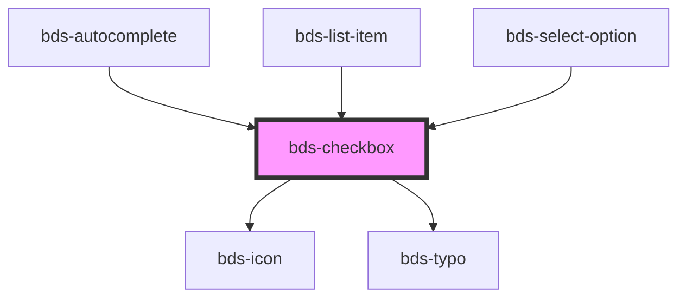

# bds-checklist

<!-- Auto Generated Below -->

## Properties

| Property             | Attribute   | Description                                                             | Type      | Default     |
| -------------------- | ----------- | ----------------------------------------------------------------------- | --------- | ----------- |
| `checked`            | `checked`   | If `true`, the checkbox is selected.                                    | `boolean` | `false`     |
| `dataTest`           | `data-test` | Data test is the prop to specifically test the component action object. | `string`  | `null`      |
| `disabled`           | `disabled`  | If `true`, the user cannot interact with the checkbox.                  | `boolean` | `false`     |
| `label` _(required)_ | `label`     |                                                                         | `string`  | `undefined` |
| `name` _(required)_  | `name`      | The name of the control, which is submitted with the form data.         | `string`  | `undefined` |
| `refer` _(required)_ | `refer`     |                                                                         | `string`  | `undefined` |

## Events

| Event       | Description                         | Type                                 |
| ----------- | ----------------------------------- | ------------------------------------ |
| `bdsChange` | Emitted when the value has changed. | `CustomEvent<{ checked: boolean; }>` |
| `bdsInput`  | Emitted when the input has changed. | `CustomEvent<KeyboardEvent>`         |

## Methods

### `getInputElement() => Promise<HTMLInputElement>`

#### Returns

Type: `Promise<HTMLInputElement>`

### `getValue() => Promise<boolean>`

#### Returns

Type: `Promise<boolean>`

### `toggle() => Promise<void>`

#### Returns

Type: `Promise<void>`

## Dependencies

### Used by

 - [bds-autocomplete](../autocomplete)
 - [bds-list-item](../list)
 - [bds-select-option](../select-option)

### Depends on

- [bds-icon](../icon)
- [bds-typo](../typo)

### Graph

----------------------------------------------

*Built with [StencilJS](https://stenciljs.com/)*
