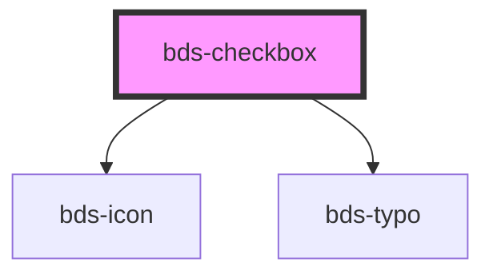

# bds-checklist

<!-- Auto Generated Below -->

## Properties

| Property             | Attribute  | Description                                            | Type      | Default     |
| -------------------- | ---------- | ------------------------------------------------------ | --------- | ----------- |
| `checked`            | `checked`  | If `true`, the checkbox is selected.                   | `boolean` | `false`     |
| `disabled`           | `disabled` | If `true`, the user cannot interact with the checkbox. | `boolean` | `false`     |
| `group` _(required)_ | `group`    |                                                        | `string`  | `undefined` |
| `label` _(required)_ | `label`    |                                                        | `string`  | `undefined` |
| `refer` _(required)_ | `refer`    |                                                        | `string`  | `undefined` |

## Events

| Event       | Description                         | Type                         |
| ----------- | ----------------------------------- | ---------------------------- |
| `bdsChange` | Emitted when the value has changed. | `CustomEvent<any>`           |
| `bdsInput`  | Emitted when the input has changed. | `CustomEvent<KeyboardEvent>` |

## Methods

### `getInputElement() => Promise<HTMLInputElement>`

#### Returns

Type: `Promise<HTMLInputElement>`

### `getValue() => Promise<boolean>`

#### Returns

Type: `Promise<boolean>`

## Dependencies

### Depends on

- [bds-icon](../icon)
- [bds-typo](../typo)

### Graph

----------------------------------------------

*Built with [StencilJS](https://stenciljs.com/)*
