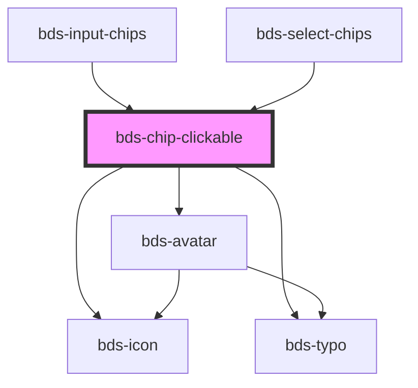

# chip-clickable

<!-- Auto Generated Below -->

## Properties

| Property    | Attribute   | Description                                                             | Type                                                                     | Default      |
| ----------- | ----------- | ----------------------------------------------------------------------- | ------------------------------------------------------------------------ | ------------ |
| `avatar`    | `avatar`    | used for add avatar left container. Uses the bds-avatar component.      | `string`                                                                 | `undefined`  |
| `clickable` | `clickable` | it makes the chip clickable.                                            | `boolean`                                                                | `false`      |
| `close`     | `close`     | used for delete the chip.                                               | `boolean`                                                                | `false`      |
| `color`     | `color`     | used for change the color. Uses one of them.                            | `"danger" \| "default" \| "info" \| "outline" \| "success" \| "warning"` | `'default'`  |
| `dataTest`  | `data-test` | Data test is the prop to specifically test the component action object. | `string`                                                                 | `null`       |
| `disabled`  | `disabled`  | the chip gone stay disabled while this prop be true.                    | `boolean`                                                                | `false`      |
| `icon`      | `icon`      | used for add icon in left container. Uses the bds-icon component.       | `string`                                                                 | `undefined`  |
| `size`      | `size`      | used for change the size chip. Uses one of them.                        | `"standard" \| "tall"`                                                   | `'standard'` |

## Events

| Event                | Description                                                                                    | Type               |
| -------------------- | ---------------------------------------------------------------------------------------------- | ------------------ |
| `chipClickableClick` |                                                                                                | `CustomEvent<any>` |
| `chipClickableClose` | Triggered after a mouse click on close icon, return id element. Only fired when close is true. | `CustomEvent<any>` |

## Dependencies

### Used by

 - [bds-input-chips](../input-chips)
 - [bds-select-chips](../selects/select-chips)

### Depends on

- [bds-icon](../icon)
- [bds-avatar](../avatar)
- [bds-typo](../typo)

### Graph

----------------------------------------------

*Built with [StencilJS](https://stenciljs.com/)*
