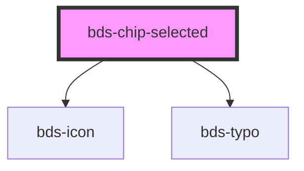

# chip-selected

<!-- Auto Generated Below -->

## Properties

| Property   | Attribute   | Description                                                             | Type                                                                     | Default      |
| ---------- | ----------- | ----------------------------------------------------------------------- | ------------------------------------------------------------------------ | ------------ |
| `color`    | `color`     | used for change the color. Uses one of them.                            | `"danger" \| "default" \| "info" \| "outline" \| "success" \| "warning"` | `'default'`  |
| `dataTest` | `data-test` | Data test is the prop to specifically test the component action object. | `string`                                                                 | `null`       |
| `disabled` | `disabled`  | When 'true', no events will be dispatched                               | `boolean`                                                                | `false`      |
| `icon`     | `icon`      | used for add icon in left container. Uses the bds-icon component.       | `string`                                                                 | `undefined`  |
| `selected` | `selected`  | used for set the initial setup for true;                                | `boolean`                                                                | `false`      |
| `size`     | `size`      | used for change the chip size. Use one of them;                         | `"standard" \| "tall"`                                                   | `'standard'` |

## Events

| Event       | Description | Type                                  |
| ----------- | ----------- | ------------------------------------- |
| `chipClick` |             | `CustomEvent<{ selected: boolean; }>` |

## Dependencies

### Depends on

- [bds-icon](../icon)
- [bds-typo](../typo)

### Graph

----------------------------------------------

*Built with [StencilJS](https://stenciljs.com/)*
