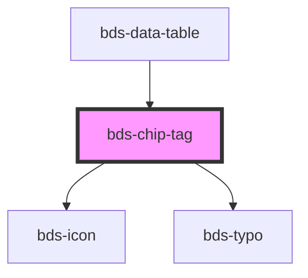

# chip-tag

<!-- Auto Generated Below -->

## Properties

| Property   | Attribute   | Description                                                             | Type                                                                                   | Default     |
| ---------- | ----------- | ----------------------------------------------------------------------- | -------------------------------------------------------------------------------------- | ----------- |
| `color`    | `color`     | used for change the color. Uses one of them.                            | `"danger" \| "default" \| "disabled" \| "info" \| "outline" \| "success" \| "warning"` | `'default'` |
| `dataTest` | `data-test` | Data test is the prop to specifically test the component action object. | `string`                                                                               | `null`      |
| `icon`     | `icon`      | used for add icon in left container. Uses the bds-icon component.       | `string`                                                                               | `undefined` |

## Dependencies

### Used by

 - [bds-data-table](../table)

### Depends on

- [bds-icon](../icon)
- [bds-typo](../typo)

### Graph

----------------------------------------------

*Built with [StencilJS](https://stenciljs.com/)*
