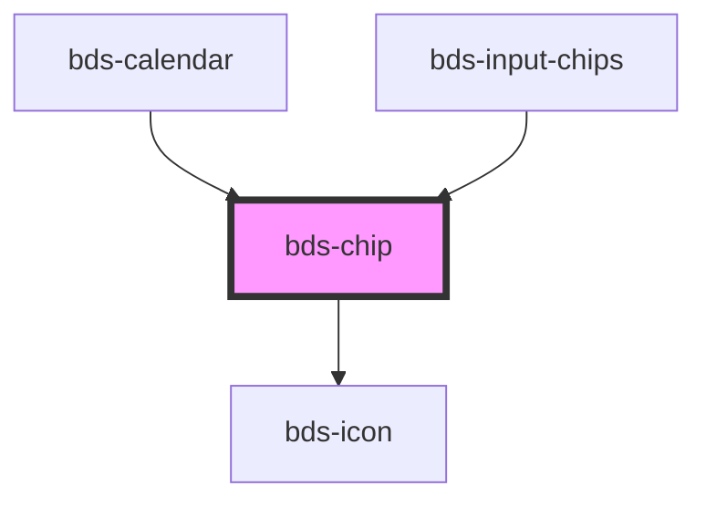

# bds-chip

<!-- Auto Generated Below -->

## Properties

| Property    | Attribute   | Description                                                                               | Type                                     | Default      |
| ----------- | ----------- | ----------------------------------------------------------------------------------------- | ---------------------------------------- | ------------ |
| `clickable` | `clickable` | When 'true' and the component is using the primary variant, a hover is added              | `boolean`                                | `false`      |
| `danger`    | `danger`    | Add state danger on chip, use for use feedback.                                           | `boolean`                                | `false`      |
| `deletable` | `deletable` | When 'true', the component recive remove button and dispach event onBdsDelete             | `boolean`                                | `false`      |
| `disabled`  | `disabled`  | When 'true', no events will be dispatched                                                 | `boolean`                                | `false`      |
| `filter`    | `filter`    | Add state filter on chip whith specific color.                                            | `boolean`                                | `false`      |
| `icon`      | `icon`      | used for add icon in left container. Uses the bds-icon component.                         | `string`                                 | `undefined`  |
| `size`      | `size`      | Chip size. Entered as one of the size design tokens. Can be one of: "standard" and "tall" | `"standard" \| "tall"`                   | `'standard'` |
| `variant`   | `variant`   | Variant. Entered as one of the variant. Can be one of: 'primary', 'default';              | `"default" \| "primary" \| "watermelon"` | `'default'`  |

## Events

| Event       | Description                                                                                         | Type               |
| ----------- | --------------------------------------------------------------------------------------------------- | ------------------ |
| `bdsDelete` | Triggered after a mouse click on delete icon, return id element. Only fired when deletable is true. | `CustomEvent<any>` |

## Dependencies

### Used by

 - [bds-calendar](../calendar)
 - [bds-input-chips](../input-chips)

### Depends on

- [bds-icon](../icon)

### Graph

----------------------------------------------

*Built with [StencilJS](https://stenciljs.com/)*
