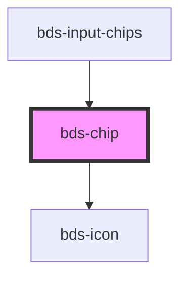

# bds-chip

<!-- Auto Generated Below -->

## Properties

| Property    | Attribute   | Description                                                                  | Type                     | Default      |
| ----------- | ----------- | ---------------------------------------------------------------------------- | ------------------------ | ------------ |
| `clickable` | `clickable` |                                                                              | `boolean`                | `false`      |
| `danger`    | `danger`    | Add state danger on chip, use for use feedback.                              | `boolean`                | `false`      |
| `deletable` | `deletable` |                                                                              | `boolean`                | `false`      |
| `disabled`  | `disabled`  |                                                                              | `boolean`                | `false`      |
| `icon`      | `icon`      |                                                                              | `string`                 | `undefined`  |
| `size`      | `size`      |                                                                              | `"standard" \| "tall"`   | `'standard'` |
| `variant`   | `variant`   | Variant. Entered as one of the variant. Can be one of: 'primary', 'default'; | `"default" \| "primary"` | `'default'`  |

## Events

| Event       | Description                                                                                         | Type               |
| ----------- | --------------------------------------------------------------------------------------------------- | ------------------ |
| `bdsDelete` | Triggered after a mouse click on delete icon, return id element. Only fired when deletable is true. | `CustomEvent<any>` |

## Dependencies

### Used by

 - [bds-input-chips](../input-chips)

### Depends on

- [bds-icon](../icon)

### Graph

----------------------------------------------

*Built with [StencilJS](https://stenciljs.com/)*
