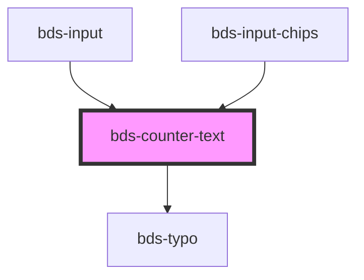

# bds-counter

<!-- Auto Generated Below -->

## Properties

| Property              | Attribute | Description | Type                            | Default               |
| --------------------- | --------- | ----------- | ------------------------------- | --------------------- |
| `active`              | `active`  |             | `boolean`                       | `false`               |
| `delete`              | `delete`  |             | `{ max: number; min: number; }` | `{ max: 1, min: 0 }`  |
| `length` _(required)_ | `length`  |             | `number`                        | `undefined`           |
| `max`                 | `max`     |             | `number`                        | `undefined`           |
| `warning`             | `warning` |             | `{ max: number; min: number; }` | `{ max: 20, min: 2 }` |

## Dependencies

### Used by

 - [bds-input](../input)
 - [bds-input-chips](../input-chips)

### Depends on

- [bds-typo](../typo)

### Graph

----------------------------------------------

*Built with [StencilJS](https://stenciljs.com/)*
