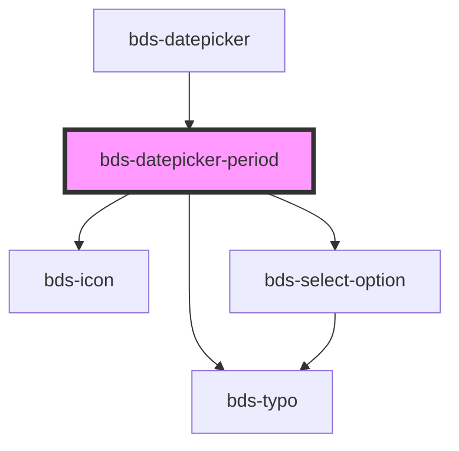

# bds-datepicker

<!-- Auto Generated Below -->

## Properties

| Property          | Attribute | Description                                                  | Type       | Default                           |
| ----------------- | --------- | ------------------------------------------------------------ | ---------- | --------------------------------- |
| `endDate`         | --        | EndDate. Insert a limiter to select the date period.         | `DaysList` | `dateToDayList(defaultEndDate)`   |
| `endDateSelect`   | --        | EndDateSelect. Insert a limiter to select the date period.   | `Date`     | `null`                            |
| `startDate`       | --        | StartDate. Insert a limiter to select the date period.       | `DaysList` | `dateToDayList(defaultStartDate)` |
| `startDateSelect` | --        | StartDateSelect. Insert a limiter to select the date period. | `Date`     | `null`                            |

## Events

| Event          | Description | Type               |
| -------------- | ----------- | ------------------ |
| `bdsEndDate`   |             | `CustomEvent<any>` |
| `bdsStartDate` |             | `CustomEvent<any>` |

## Methods

### `clear() => Promise<void>`

Return the validity of the input.

#### Returns

Type: `Promise<void>`

## Dependencies

### Used by

 - [bds-datepicker](..)

### Depends on

- [bds-typo](../../typo)
- [bds-icon](../../icon)
- [bds-select-option](../../select-option)

### Graph

----------------------------------------------

*Built with [StencilJS](https://stenciljs.com/)*
