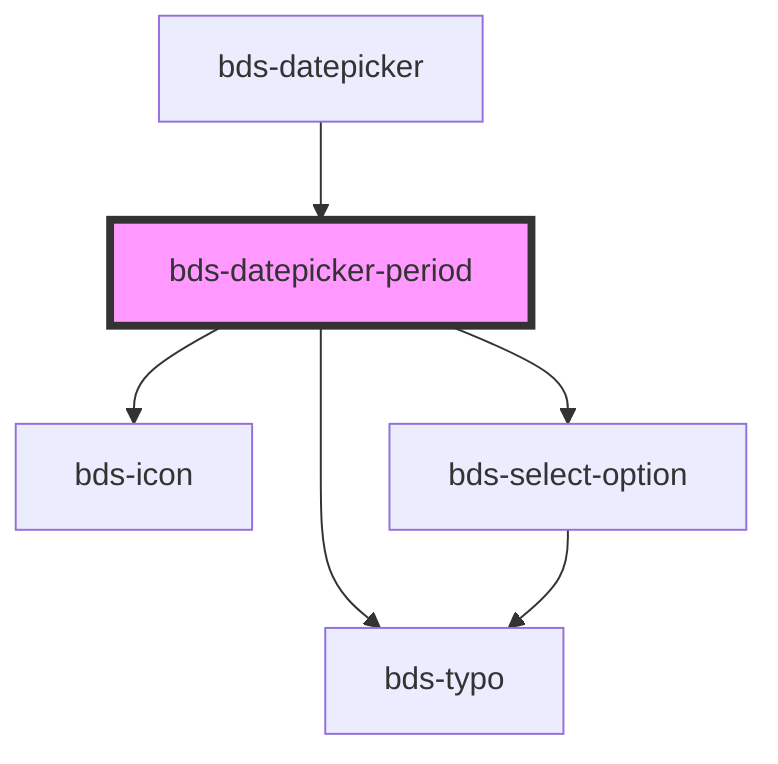

# bds-datepicker

<!-- Auto Generated Below -->

## Properties

| Property    | Attribute | Description                                            | Type       | Default |
| ----------- | --------- | ------------------------------------------------------ | ---------- | ------- |
| `endDate`   | --        | EndDate. Insert a limiter to select the date period.   | `DaysList` | `null`  |
| `startDate` | --        | StartDate. Insert a limiter to select the date period. | `DaysList` | `null`  |

## Events

| Event          | Description | Type                |
| -------------- | ----------- | ------------------- |
| `bdsEndDate`   |             | `CustomEvent<Date>` |
| `bdsStartDate` |             | `CustomEvent<Date>` |

## Dependencies

### Used by

 - [bds-datepicker](..)

### Depends on

- [bds-typo](../../typo)
- [bds-icon](../../icon)
- [bds-select-option](../../select-option)

### Graph

----------------------------------------------

*Built with [StencilJS](https://stenciljs.com/)*
