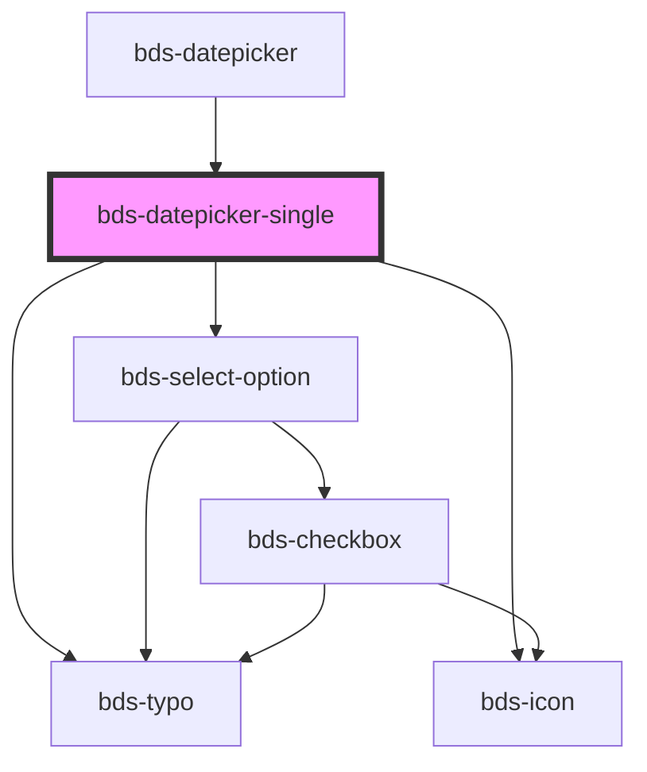

# bds-datepicker

<!-- Auto Generated Below -->

## Properties

| Property        | Attribute         | Description                                                                                                             | Type                            | Default                           |
| --------------- | ----------------- | ----------------------------------------------------------------------------------------------------------------------- | ------------------------------- | --------------------------------- |
| `dateSelect`    | `date-select`     | dateSelect. Insert a limiter to select the date period.                                                                 | `Date`                          | `null`                            |
| `dtButtonNext`  | `dt-button-next`  | Data test is the prop to specifically test the component action object. dtButtonNext is the data-test to button next.   | `string`                        | `null`                            |
| `dtButtonPrev`  | `dt-button-prev`  | Data test is the prop to specifically test the component action object. dtButtonPrev is the data-test to button prev.   | `string`                        | `null`                            |
| `dtSelectMonth` | `dt-select-month` | Data test is the prop to specifically test the component action object. dtSelectMonth is the data-test to select month. | `string`                        | `null`                            |
| `dtSelectYear`  | `dt-select-year`  | Data test is the prop to specifically test the component action object. dtSelectYear is the data-test to select year.   | `string`                        | `null`                            |
| `endDate`       | `end-date`        | EndDate. Insert a limiter to select the date period.                                                                    | `DaysList`                      | `dateToDayList(defaultEndDate)`   |
| `language`      | `language`        | Language, Entered as one of the languages. Can be one of: 'pt_BR', 'es_ES', 'en_US'.                                    | `"en_US" \| "es_ES" \| "pt_BR"` | `'pt_BR'`                         |
| `startDate`     | `start-date`      | StartDate. Insert a limiter to select the date period.                                                                  | `DaysList`                      | `dateToDayList(defaultStartDate)` |

## Events

| Event             | Description                                           | Type                            |
| ----------------- | ----------------------------------------------------- | ------------------------------- |
| `bdsDateSelected` | bdsDateSelected. Event to return selected date value. | `CustomEvent<{ value: Date; }>` |

## Methods

### `clear() => Promise<void>`

Return the validity of the input.

#### Returns

Type: `Promise<void>`

## Dependencies

### Used by

 - [bds-datepicker](..)

### Depends on

- [bds-typo](../../typo)
- [bds-icon](../../icon)
- [bds-select-option](../../select-option)

### Graph

----------------------------------------------

*Built with [StencilJS](https://stenciljs.com/)*
