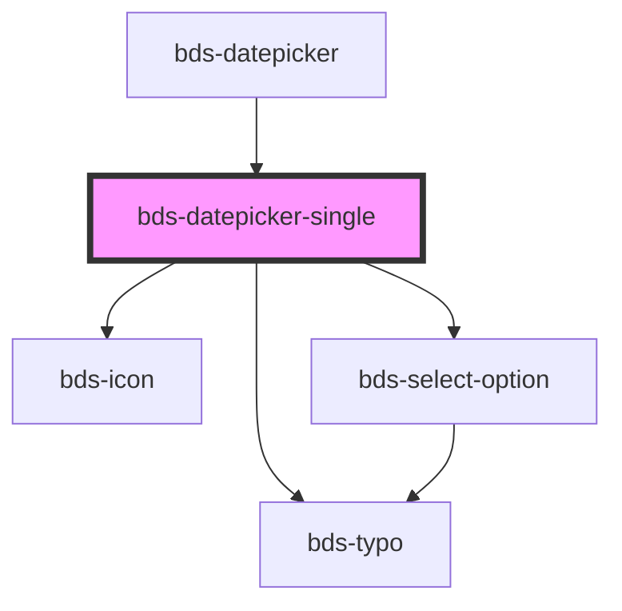

# bds-datepicker

<!-- Auto Generated Below -->

## Properties

| Property     | Attribute | Description                                             | Type       | Default                           |
| ------------ | --------- | ------------------------------------------------------- | ---------- | --------------------------------- |
| `dateSelect` | --        | dateSelect. Insert a limiter to select the date period. | `Date`     | `null`                            |
| `endDate`    | --        | EndDate. Insert a limiter to select the date period.    | `DaysList` | `dateToDayList(defaultEndDate)`   |
| `startDate`  | --        | StartDate. Insert a limiter to select the date period.  | `DaysList` | `dateToDayList(defaultStartDate)` |

## Events

| Event             | Description                                           | Type               |
| ----------------- | ----------------------------------------------------- | ------------------ |
| `bdsDateSelected` | bdsDateSelected. Event to return selected date value. | `CustomEvent<any>` |

## Methods

### `clear() => Promise<void>`

Return the validity of the input.

#### Returns

Type: `Promise<void>`

## Dependencies

### Used by

 - [bds-datepicker](..)

### Depends on

- [bds-typo](../../typo)
- [bds-icon](../../icon)
- [bds-select-option](../../select-option)

### Graph

----------------------------------------------

*Built with [StencilJS](https://stenciljs.com/)*
