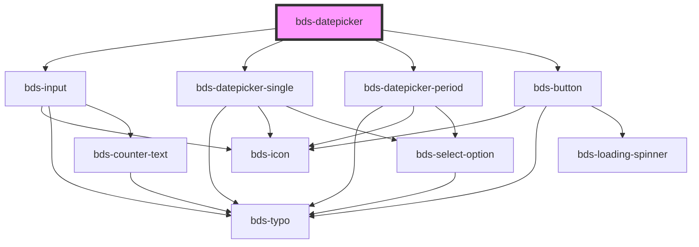

# bds-datepicker

<!-- Auto Generated Below -->

## Properties

| Property         | Attribute          | Description                                                 | Type                   | Default            |
| ---------------- | ------------------ | ----------------------------------------------------------- | ---------------------- | ------------------ |
| `endDateLimit`   | `end-date-limit`   | EndDateLimit. Insert a limiter to select the date period.   | `string`               | `defaultEndDate`   |
| `startDateLimit` | `start-date-limit` | StartDateLimit. Insert a limiter to select the date period. | `string`               | `defaultStartDate` |
| `typeOfDate`     | `type-of-date`     | TypeOfDate. Select type of date.                            | `"period" \| "single"` | `'single'`         |

## Dependencies

### Depends on

- [bds-input](../input)
- [bds-datepicker-single](datepicker-single)
- [bds-datepicker-period](datepicker-period)
- [bds-button](../button)

### Graph

----------------------------------------------

*Built with [StencilJS](https://stenciljs.com/)*
