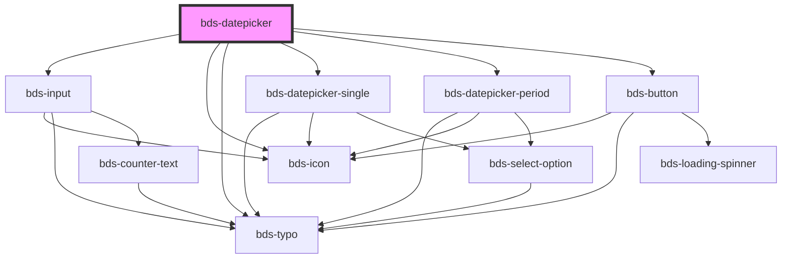

# bds-datepicker

<!-- Auto Generated Below -->

## Properties

| Property               | Attribute                 | Description                                                                                                                 | Type                            | Default            |
| ---------------------- | ------------------------- | --------------------------------------------------------------------------------------------------------------------------- | ------------------------------- | ------------------ |
| `disabled`             | `disabled`                | Disabled input.                                                                                                             | `boolean`                       | `false`            |
| `dtButtonClear`        | `dt-button-clear`         | Data test is the prop to specifically test the component action object. dtButtonClear is the data-test to button clear.     | `string`                        | `null`             |
| `dtButtonConfirm`      | `dt-button-confirm`       | Data test is the prop to specifically test the component action object. dtButtonConfirm is the data-test to button confirm. | `string`                        | `null`             |
| `dtButtonNext`         | `dt-button-next`          | Data test is the prop to specifically test the component action object. dtButtonNext is the data-test to button next.       | `string`                        | `null`             |
| `dtButtonPrev`         | `dt-button-prev`          | Data test is the prop to specifically test the component action object. dtButtonPrev is the data-test to button prev.       | `string`                        | `null`             |
| `dtInputEnd`           | `dt-input-end`            | Data test is the prop to specifically test the component action object. dtInputEnd is the data-test to input end.           | `string`                        | `null`             |
| `dtInputStart`         | `dt-input-start`          | Data test is the prop to specifically test the component action object. dtInputStart is the data-test to input start.       | `string`                        | `null`             |
| `dtOutzone`            | `dt-outzone`              | Data test is the prop to specifically test the component action object. dtOutzone is the data-test to outzone.              | `string`                        | `null`             |
| `dtSelectMonth`        | `dt-select-month`         | Data test is the prop to specifically test the component action object. dtSelectMonth is the data-test to select month.     | `string`                        | `null`             |
| `dtSelectYear`         | `dt-select-year`          | Data test is the prop to specifically test the component action object. dtSelectYear is the data-test to select year.       | `string`                        | `null`             |
| `endDateLimit`         | `end-date-limit`          | EndDateLimit. Insert a limiter to select the date period.                                                                   | `string`                        | `defaultEndDate`   |
| `language`             | `language`                | Language, Entered as one of the languages. Can be one of: 'pt_BR', 'es_ES', 'en_US'.                                        | `"en_US" \| "es_ES" \| "pt_BR"` | `'pt_BR'`          |
| `message`              | `message`                 | Message. Select type of date.                                                                                               | `string`                        | `null`             |
| `startDateLimit`       | `start-date-limit`        | StartDateLimit. Insert a limiter to select the date period.                                                                 | `string`                        | `defaultStartDate` |
| `typeOfDate`           | `type-of-date`            | TypeOfDate. Select type of date.                                                                                            | `"period" \| "single"`          | `'single'`         |
| `valueDateSelected`    | `value-date-selected`     | Default value input.                                                                                                        | `string`                        | `null`             |
| `valueEndDateSelected` | `value-end-date-selected` | Default value input.                                                                                                        | `string`                        | `null`             |

## Events

| Event                | Description                                            | Type               |
| -------------------- | ------------------------------------------------------ | ------------------ |
| `bdsEndDate`         | bdsStartDate. Event to return selected end date value. | `CustomEvent<any>` |
| `bdsStartDate`       | bdsStartDate. Event to return selected date value.     | `CustomEvent<any>` |
| `concludeDatepicker` | bdsStartDate. Event to return selected end date value. | `CustomEvent<any>` |

## Dependencies

### Depends on

- [bds-input](../input)
- [bds-icon](../icon)
- [bds-typo](../typo)
- [bds-datepicker-single](datepicker-single)
- [bds-datepicker-period](datepicker-period)
- [bds-button](../button)

### Graph

----------------------------------------------

*Built with [StencilJS](https://stenciljs.com/)*
