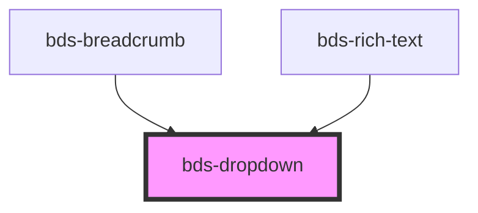

# bds-menu

<!-- Auto Generated Below -->

## Properties

| Property     | Attribute     | Description                                                             | Type                                                                                                                                                                                                           | Default   |
| ------------ | ------------- | ----------------------------------------------------------------------- | -------------------------------------------------------------------------------------------------------------------------------------------------------------------------------------------------------------- | --------- |
| `activeMode` | `active-mode` | Open. Used to open/close the dropdown.                                  | `"click" \| "hover"`                                                                                                                                                                                           | `'click'` |
| `dataTest`   | `data-test`   | Data test is the prop to specifically test the component action object. | `string`                                                                                                                                                                                                       | `null`    |
| `open`       | `open`        | Open. Used to open/close the dropdown.                                  | `boolean`                                                                                                                                                                                                      | `false`   |
| `position`   | `position`    | Used to set drop position                                               | `"auto" \| "bottom-center" \| "bottom-left" \| "bottom-right" \| "left-bottom" \| "left-center" \| "left-top" \| "right-bottom" \| "right-center" \| "right-top" \| "top-center" \| "top-left" \| "top-right"` | `'auto'`  |

## Events

| Event       | Description                                     | Type               |
| ----------- | ----------------------------------------------- | ------------------ |
| `bdsToggle` | bdsToggle. Event to return selected date value. | `CustomEvent<any>` |

## Methods

### `setClose() => Promise<void>`

#### Returns

Type: `Promise<void>`

### `setOpen() => Promise<void>`

#### Returns

Type: `Promise<void>`

### `toggle() => Promise<void>`

#### Returns

Type: `Promise<void>`

## Dependencies

### Used by

 - [bds-breadcrumb](../breadcrumb)
 - [bds-rich-text](../rict-text)

### Graph

----------------------------------------------

*Built with [StencilJS](https://stenciljs.com/)*
