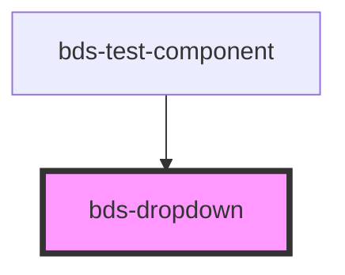

# bds-menu

<!-- Auto Generated Below -->

## Properties

| Property     | Attribute     | Description                            | Type                                                                                                        | Default   |
| ------------ | ------------- | -------------------------------------- | ----------------------------------------------------------------------------------------------------------- | --------- |
| `activeMode` | `active-mode` | Open. Used to open/close the dropdown. | `"click" \| "hover"`                                                                                        | `'click'` |
| `open`       | `open`        | Open. Used to open/close the dropdown. | `boolean`                                                                                                   | `false`   |
| `position`   | `position`    | Used to set tooltip position           | `"auto" \| "bottom-center" \| "bottom-left" \| "bottom-right" \| "top-center" \| "top-left" \| "top-right"` | `'auto'`  |

## Events

| Event       | Description                                     | Type               |
| ----------- | ----------------------------------------------- | ------------------ |
| `bdsToggle` | bdsToggle. Event to return selected date value. | `CustomEvent<any>` |

## Methods

### `toggle() => Promise<void>`

#### Returns

Type: `Promise<void>`

## Dependencies

### Used by

 - [bds-test-component](../test-component)

### Graph

----------------------------------------------

*Built with [StencilJS](https://stenciljs.com/)*
