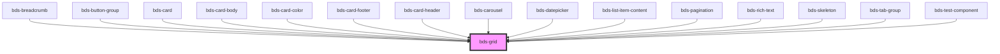

# bds-grid

<!-- Auto Generated Below -->

## Properties

| Property         | Attribute         | Description | Type                                                                                                                                                                                                                                                                                                                                                                                                                                                                                                                                                                                                                                                                                                                                                                                                                                                                                                                                                | Default     |
| ---------------- | ----------------- | ----------- | --------------------------------------------------------------------------------------------------------------------------------------------------------------------------------------------------------------------------------------------------------------------------------------------------------------------------------------------------------------------------------------------------------------------------------------------------------------------------------------------------------------------------------------------------------------------------------------------------------------------------------------------------------------------------------------------------------------------------------------------------------------------------------------------------------------------------------------------------------------------------------------------------------------------------------------------------- | ----------- |
| `alignItems`     | `align-items`     |             | `"baseline" \| "center" \| "flex-end" \| "flex-start" \| "stretch"`                                                                                                                                                                                                                                                                                                                                                                                                                                                                                                                                                                                                                                                                                                                                                                                                                                                                                 | `undefined` |
| `bgColor`        | `bg-color`        |             | `"$color-brand" \| "$color-primary" \| "$color-secondary" \| "$color-surface-0" \| "$color-surface-1" \| "$color-surface-2" \| "$color-surface-3" \| "$color-surface-4" \| "$color-surface-positive" \| "$color-surface-negative" \| "$color-surface-primary" \| "$color-content-default" \| "$color-content-disable" \| "$color-content-ghost" \| "$color-content-bright" \| "$color-content-din" \| "$color-border-1" \| "$color-border-2" \| "$color-border-3" \| "$color-info" \| "$color-system" \| "$color-focus" \| "$color-success" \| "$color-warning" \| "$color-error" \| "$color-delete" \| "$color-shadow-0" \| "$color-shadow-1" \| "$color-hover" \| "$color-pressed" \| "$color-positive" \| "$color-negative"`                                                                                                                                                                                                                     | `undefined` |
| `container`      | `container`       |             | `boolean`                                                                                                                                                                                                                                                                                                                                                                                                                                                                                                                                                                                                                                                                                                                                                                                                                                                                                                                                           | `undefined` |
| `containerFluid` | `container-fluid` |             | `boolean`                                                                                                                                                                                                                                                                                                                                                                                                                                                                                                                                                                                                                                                                                                                                                                                                                                                                                                                                           | `undefined` |
| `direction`      | `direction`       |             | `"column" \| "column-reverse" \| "row" \| "row-reverse"`                                                                                                                                                                                                                                                                                                                                                                                                                                                                                                                                                                                                                                                                                                                                                                                                                                                                                            | `undefined` |
| `flexWrap`       | `flex-wrap`       |             | `"wrap" \| "wrap-reverse"`                                                                                                                                                                                                                                                                                                                                                                                                                                                                                                                                                                                                                                                                                                                                                                                                                                                                                                                          | `undefined` |
| `gap`            | `gap`             |             | `"1" \| "10" \| "11" \| "12" \| "2" \| "3" \| "4" \| "5" \| "6" \| "7" \| "8" \| "9" \| "half" \| "none"`                                                                                                                                                                                                                                                                                                                                                                                                                                                                                                                                                                                                                                                                                                                                                                                                                                           | `undefined` |
| `height`         | `height`          |             | `string`                                                                                                                                                                                                                                                                                                                                                                                                                                                                                                                                                                                                                                                                                                                                                                                                                                                                                                                                            | `undefined` |
| `justifyContent` | `justify-content` |             | `"center" \| "flex-end" \| "flex-start" \| "space-around" \| "space-between" \| "space-evenly" \| "stretch"`                                                                                                                                                                                                                                                                                                                                                                                                                                                                                                                                                                                                                                                                                                                                                                                                                                        | `undefined` |
| `lg`             | `lg`              |             | `"1" \| "10" \| "11" \| "12" \| "2" \| "3" \| "4" \| "5" \| "6" \| "7" \| "8" \| "9" \| "auto"`                                                                                                                                                                                                                                                                                                                                                                                                                                                                                                                                                                                                                                                                                                                                                                                                                                                     | `undefined` |
| `lgOffset`       | `lg-offset`       |             | `"1" \| "10" \| "11" \| "12" \| "2" \| "3" \| "4" \| "5" \| "6" \| "7" \| "8" \| "9" \| "auto"`                                                                                                                                                                                                                                                                                                                                                                                                                                                                                                                                                                                                                                                                                                                                                                                                                                                     | `undefined` |
| `margin`         | `margin`          |             | `"none" \| "half" \| "1" \| "2" \| "3" \| "4" \| "5" \| "6" \| "7" \| "8" \| "9" \| "10" \| "11" \| "12" \| "l-none" \| "l-half" \| "l-1" \| "l-2" \| "l-3" \| "l-4" \| "l-5" \| "l-6" \| "l-7" \| "l-8" \| "l-9" \| "l-10" \| "l-11" \| "l-12" \| "b-none" \| "b-half" \| "b-1" \| "b-2" \| "b-3" \| "b-4" \| "b-5" \| "b-6" \| "b-7" \| "b-8" \| "b-9" \| "b-10" \| "b-11" \| "r-none" \| "r-half" \| "r-1" \| "r-2" \| "r-3" \| "r-4" \| "r-5" \| "r-6" \| "r-7" \| "r-8" \| "r-9" \| "r-10" \| "r-11" \| "r-12" \| "t-none" \| "t-half" \| "t-1" \| "t-2" \| "t-3" \| "t-4" \| "t-5" \| "t-6" \| "t-7" \| "t-8" \| "t-9" \| "t-10" \| "t-11" \| "t-12" \| "y-none" \| "y-half" \| "y-1" \| "y-2" \| "y-3" \| "y-4" \| "y-5" \| "y-6" \| "y-7" \| "y-8" \| "y-9" \| "y-10" \| "y-11" \| "y-12" \| "x-none" \| "x-half" \| "x-1" \| "x-2" \| "x-3" \| "x-4" \| "x-5" \| "x-6" \| "x-7" \| "x-8" \| "x-9" \| "x-10" \| "x-11" \| "x-12"`           | `undefined` |
| `md`             | `md`              |             | `"1" \| "10" \| "11" \| "12" \| "2" \| "3" \| "4" \| "5" \| "6" \| "7" \| "8" \| "9" \| "auto"`                                                                                                                                                                                                                                                                                                                                                                                                                                                                                                                                                                                                                                                                                                                                                                                                                                                     | `undefined` |
| `mdOffset`       | `md-offset`       |             | `"1" \| "10" \| "11" \| "12" \| "2" \| "3" \| "4" \| "5" \| "6" \| "7" \| "8" \| "9" \| "auto"`                                                                                                                                                                                                                                                                                                                                                                                                                                                                                                                                                                                                                                                                                                                                                                                                                                                     | `undefined` |
| `padding`        | `padding`         |             | `"none" \| "half" \| "1" \| "2" \| "3" \| "4" \| "5" \| "6" \| "7" \| "8" \| "9" \| "10" \| "11" \| "12" \| "l-none" \| "l-half" \| "l-1" \| "l-2" \| "l-3" \| "l-4" \| "l-5" \| "l-6" \| "l-7" \| "l-8" \| "l-9" \| "l-10" \| "l-11" \| "l-12" \| "b-none" \| "b-half" \| "b-1" \| "b-2" \| "b-3" \| "b-4" \| "b-5" \| "b-6" \| "b-7" \| "b-8" \| "b-9" \| "b-10" \| "b-11" \| "b-12" \| "r-none" \| "r-half" \| "r-1" \| "r-2" \| "r-3" \| "r-4" \| "r-5" \| "r-6" \| "r-7" \| "r-8" \| "r-9" \| "r-10" \| "r-11" \| "r-12" \| "t-none" \| "t-half" \| "t-1" \| "t-2" \| "t-3" \| "t-4" \| "t-5" \| "t-6" \| "t-7" \| "t-8" \| "t-9" \| "t-10" \| "t-11" \| "t-12" \| "y-none" \| "y-half" \| "y-1" \| "y-2" \| "y-3" \| "y-4" \| "y-5" \| "y-6" \| "y-7" \| "y-8" \| "y-9" \| "y-10" \| "y-11" \| "y-12" \| "x-none" \| "x-half" \| "x-1" \| "x-2" \| "x-3" \| "x-4" \| "x-5" \| "x-6" \| "x-7" \| "x-8" \| "x-9" \| "x-10" \| "x-11" \| "x-12"` | `undefined` |
| `sm`             | `sm`              |             | `"1" \| "10" \| "11" \| "12" \| "2" \| "3" \| "4" \| "5" \| "6" \| "7" \| "8" \| "9" \| "auto"`                                                                                                                                                                                                                                                                                                                                                                                                                                                                                                                                                                                                                                                                                                                                                                                                                                                     | `undefined` |
| `smOffset`       | `sm-offset`       |             | `"1" \| "10" \| "11" \| "12" \| "2" \| "3" \| "4" \| "5" \| "6" \| "7" \| "8" \| "9" \| "auto"`                                                                                                                                                                                                                                                                                                                                                                                                                                                                                                                                                                                                                                                                                                                                                                                                                                                     | `undefined` |
| `xg`             | `xg`              |             | `"1" \| "10" \| "11" \| "12" \| "2" \| "3" \| "4" \| "5" \| "6" \| "7" \| "8" \| "9" \| "auto"`                                                                                                                                                                                                                                                                                                                                                                                                                                                                                                                                                                                                                                                                                                                                                                                                                                                     | `undefined` |
| `xgOffset`       | `xg-offset`       |             | `"1" \| "10" \| "11" \| "12" \| "2" \| "3" \| "4" \| "5" \| "6" \| "7" \| "8" \| "9" \| "auto"`                                                                                                                                                                                                                                                                                                                                                                                                                                                                                                                                                                                                                                                                                                                                                                                                                                                     | `undefined` |
| `xs`             | `xs`              |             | `"1" \| "10" \| "11" \| "12" \| "2" \| "3" \| "4" \| "5" \| "6" \| "7" \| "8" \| "9" \| "auto"`                                                                                                                                                                                                                                                                                                                                                                                                                                                                                                                                                                                                                                                                                                                                                                                                                                                     | `undefined` |
| `xsOffset`       | `xs-offset`       |             | `"1" \| "10" \| "11" \| "12" \| "2" \| "3" \| "4" \| "5" \| "6" \| "7" \| "8" \| "9" \| "auto"`                                                                                                                                                                                                                                                                                                                                                                                                                                                                                                                                                                                                                                                                                                                                                                                                                                                     | `undefined` |
| `xxs`            | `xxs`             |             | `"1" \| "10" \| "11" \| "12" \| "2" \| "3" \| "4" \| "5" \| "6" \| "7" \| "8" \| "9" \| "auto"`                                                                                                                                                                                                                                                                                                                                                                                                                                                                                                                                                                                                                                                                                                                                                                                                                                                     | `undefined` |
| `xxsOffset`      | `xxs-offset`      |             | `"1" \| "10" \| "11" \| "12" \| "2" \| "3" \| "4" \| "5" \| "6" \| "7" \| "8" \| "9" \| "auto"`                                                                                                                                                                                                                                                                                                                                                                                                                                                                                                                                                                                                                                                                                                                                                                                                                                                     | `undefined` |

## Dependencies

### Used by

 - [bds-breadcrumb](../breadcrumb)
 - [bds-button-group](../button)
 - [bds-card](../card)
 - [bds-card-body](../card/card-body)
 - [bds-card-color](../card-color)
 - [bds-card-footer](../card/card-footer)
 - [bds-card-header](../card/card-header)
 - [bds-carousel](../carousel)
 - [bds-datepicker](../datepicker)
 - [bds-list-item-content](../list)
 - [bds-pagination](../pagination)
 - [bds-rich-text](../rict-text)
 - [bds-skeleton](../skeleton)
 - [bds-tab-group](../tabs)
 - [bds-test-component](../test-component)

### Graph

----------------------------------------------

*Built with [StencilJS](https://stenciljs.com/)*
