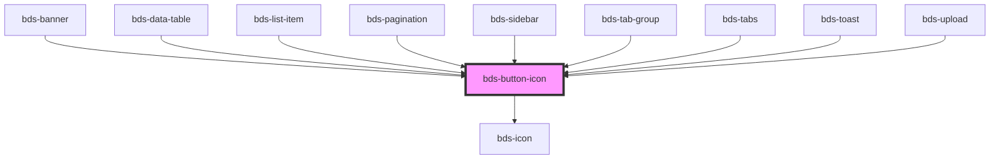

# bds-icon-button

<!-- Auto Generated Below -->

## Properties

| Property    | Attribute    | Description                                                                                       | Type                                                                                  | Default      |
| ----------- | ------------ | ------------------------------------------------------------------------------------------------- | ------------------------------------------------------------------------------------- | ------------ |
| `dataTest`  | `data-test`  | Data test is the prop to specifically test the component action object.                           | `string`                                                                              | `null`       |
| `disabled`  | `disabled`   | If true, the base button will be disabled.                                                        | `boolean`                                                                             | `false`      |
| `icon`      | `icon`       | used for add icon in input left. Uses the bds-icon component.                                     | `string`                                                                              | `null`       |
| `iconTheme` | `icon-theme` | The theme of the icon. Can be one of: 'outline', 'solid';                                         | `"outline" \| "solid"`                                                                | `'outline'`  |
| `size`      | `size`       | Size. Entered as one of the size. Can be one of: 'tall', 'standard', 'short';                     | `"short" \| "standard" \| "tall"`                                                     | `'standard'` |
| `variant`   | `variant`    | Variant. Entered as one of the variant. Can be one of: 'primary', 'secondary', 'ghost', 'dashed'; | `"delete" \| "ghost" \| "primary" \| "secondary" \| "secondary--white" \| "tertiary"` | `'primary'`  |

## Events

| Event      | Description           | Type               |
| ---------- | --------------------- | ------------------ |
| `bdsClick` | Event buttom onClick. | `CustomEvent<any>` |

## Dependencies

### Used by

 - [bds-banner](../banner)
 - [bds-data-table](../table)
 - [bds-list-item](../list)
 - [bds-pagination](../pagination)
 - [bds-sidebar](../sidebar)
 - [bds-tab-group](../tabs)
 - [bds-tabs](../tabs/tab (depreciated))
 - [bds-toast](../toast)
 - [bds-upload](../upload)

### Depends on

- [bds-icon](../icon)

### Graph

----------------------------------------------

*Built with [StencilJS](https://stenciljs.com/)*
