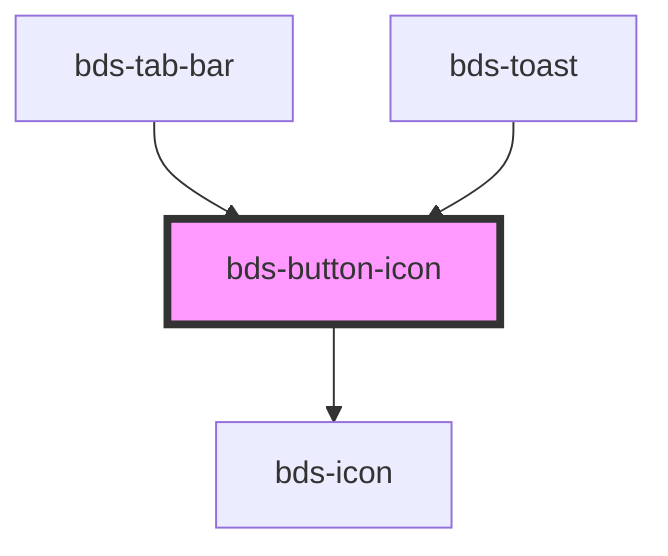

# bds-icon-button

<!-- Auto Generated Below -->

## Properties

| Property   | Attribute  | Description                                                                                       | Type                                                                                  | Default      |
| ---------- | ---------- | ------------------------------------------------------------------------------------------------- | ------------------------------------------------------------------------------------- | ------------ |
| `disabled` | `disabled` | If true, the base button will be disabled.                                                        | `boolean`                                                                             | `false`      |
| `icon`     | `icon`     | used for add icon in input left. Uses the bds-icon component.                                     | `string`                                                                              | `null`       |
| `size`     | `size`     | Size. Entered as one of the size. Can be one of: 'tall', 'standard', 'short';                     | `"short" \| "standard" \| "tall"`                                                     | `'standard'` |
| `variant`  | `variant`  | Variant. Entered as one of the variant. Can be one of: 'primary', 'secondary', 'ghost', 'dashed'; | `"delete" \| "ghost" \| "primary" \| "secondary" \| "secondary--white" \| "tertiary"` | `'primary'`  |

## Dependencies

### Used by

 - [bds-tab-bar](../tabs/tab-bar)
 - [bds-toast](../toast)

### Depends on

- [bds-icon](../icon)

### Graph

----------------------------------------------

*Built with [StencilJS](https://stenciljs.com/)*
