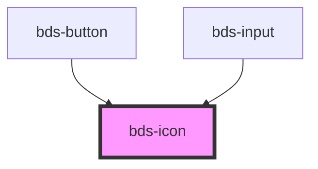

# bds-icon

<!-- Auto Generated Below -->

## Properties

| Property            | Attribute    | Description                                                                                                                                                                   | Type                                                                                                                 | Default     |
| ------------------- | ------------ | ----------------------------------------------------------------------------------------------------------------------------------------------------------------------------- | -------------------------------------------------------------------------------------------------------------------- | ----------- |
| `ariaLabel`         | `aria-label` | Specifies the label to use for accessibility. Defaults to the icon name.                                                                                                      | `string`                                                                                                             | `undefined` |
| `color`             | `color`      | Specifies the color to use.Specifies a color to use. The default is svg.                                                                                                      | `string`                                                                                                             | `undefined` |
| `name` _(required)_ | `name`       | Specifies which icon to use from the built-in set of icons.                                                                                                                   | `string`                                                                                                             | `undefined` |
| `size`              | `size`       | Icon size. Entered as one of the icon size design tokens. Can be one of:  "xxx-small", "xx-small", "x-small", "small", "medium", "large", "x-large", "xx-large", "xxx-large". | `"large" \| "medium" \| "small" \| "x-large" \| "x-small" \| "xx-large" \| "xx-small" \| "xxx-large" \| "xxx-small"` | `'medium'`  |
| `theme`             | `theme`      | Specifies the theme to use outline or solid icons. Defaults to outline.                                                                                                       | `"outline" \| "solid"`                                                                                               | `'outline'` |

## Dependencies

### Used by

 - [bds-button](../button)
 - [bds-input](../input)

### Graph

----------------------------------------------

*Built with [StencilJS](https://stenciljs.com/)*
