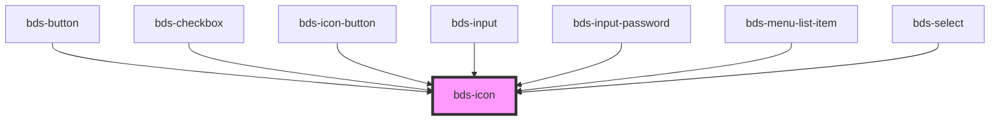

# bds-icon

<!-- Auto Generated Below -->

## Properties

| Property    | Attribute    | Description                                                                                                                                                                    | Type                                                                                                                 | Default     |
| ----------- | ------------ | ------------------------------------------------------------------------------------------------------------------------------------------------------------------------------ | -------------------------------------------------------------------------------------------------------------------- | ----------- |
| `ariaLabel` | `aria-label` | Specifies the label to use for accessibility. Defaults to the icon name.                                                                                                       | `string`                                                                                                             | `undefined` |
| `color`     | `color`      | Specifies the color to use.Specifies a color to use. The default is svg.                                                                                                       | `string`                                                                                                             | `undefined` |
| `flipRtl`   | `flip-rtl`   | Specifies whether the icon should horizontally flip when `dir` is `"rtl"`.                                                                                                     | `boolean`                                                                                                            | `undefined` |
| `icon`      | `icon`       | A combination of both `name` and `src`. If a `src` url is detected it will set the `src` property. Otherwise it assumes it's a built-in named SVG and set the `name` property. | `any`                                                                                                                | `undefined` |
| `lazy`      | `lazy`       | If enabled, ion-icon will be loaded lazily when it's visible in the viewport. Default, `false`.                                                                                | `boolean`                                                                                                            | `false`     |
| `name`      | `name`       | Specifies which icon to use from the built-in set of icons.                                                                                                                    | `string`                                                                                                             | `undefined` |
| `size`      | `size`       | Icon size. Entered as one of the icon size design tokens. Can be one of: "xxx-small", "xx-small", "x-small", "small", "medium", "large", "x-large", "xx-large", "xxx-large".   | `"large" \| "medium" \| "small" \| "x-large" \| "x-small" \| "xx-large" \| "xx-small" \| "xxx-large" \| "xxx-small"` | `'medium'`  |
| `src`       | `src`        | Specifies the exact `src` of an SVG file to use.                                                                                                                               | `string`                                                                                                             | `undefined` |
| `theme`     | `theme`      | Specifies the theme to use outline or solid icons. Defaults to outline.                                                                                                        | `"outline" \| "solid"`                                                                                               | `'outline'` |

## Dependencies

### Used by

 - [bds-button](../button)
 - [bds-checkbox](../checkbox)
 - [bds-icon-button](../icon-button)
 - [bds-input](../input)
 - [bds-input-password](../input-password)
 - [bds-menu-list-item](../menu-list-item)
 - [bds-select](../select)

### Graph

----------------------------------------------

*Built with [StencilJS](https://stenciljs.com/)*
