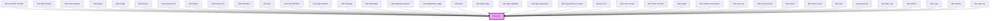

# bds-icon

<!-- Auto Generated Below -->

## Properties

| Property    | Attribute    | Description                                                                                                                                                                           | Type                                                                                                                            | Default     |
| ----------- | ------------ | ------------------------------------------------------------------------------------------------------------------------------------------------------------------------------------- | ------------------------------------------------------------------------------------------------------------------------------- | ----------- |
| `ariaLabel` | `aria-label` | Specifies the label to use for accessibility. Defaults to the icon name.                                                                                                              | `string`                                                                                                                        | `undefined` |
| `color`     | `color`      | Specifies the color to use.Specifies a color to use. The default is svg.                                                                                                              | `string`                                                                                                                        | `undefined` |
| `dataTest`  | `data-test`  | Data test is the prop to specifically test the component action object.                                                                                                               | `string`                                                                                                                        | `null`      |
| `flipRtl`   | `flip-rtl`   | Specifies whether the icon should horizontally flip when `dir` is `"rtl"`.                                                                                                            | `boolean`                                                                                                                       | `undefined` |
| `icon`      | `icon`       | A combination of both `name` and `src`. If a `src` url is detected it will set the `src` property. Otherwise it assumes it's a built-in named SVG and set the `name` property.        | `any`                                                                                                                           | `undefined` |
| `lazy`      | `lazy`       | If enabled, ion-icon will be loaded lazily when it's visible in the viewport. Default, `false`.                                                                                       | `boolean`                                                                                                                       | `false`     |
| `name`      | `name`       | Specifies which icon to use from the built-in set of icons.                                                                                                                           | `string`                                                                                                                        | `undefined` |
| `size`      | `size`       | Icon size. Entered as one of the icon size design tokens. Can be one of: "xxx-small", "xx-small", "x-small", "small", "medium", "large", "x-large", "xx-large", "xxx-large", "brand". | `"brand" \| "large" \| "medium" \| "small" \| "x-large" \| "x-small" \| "xx-large" \| "xx-small" \| "xxx-large" \| "xxx-small"` | `'medium'`  |
| `src`       | `src`        | Specifies the exact `src` of an SVG file to use.                                                                                                                                      | `string`                                                                                                                        | `undefined` |
| `theme`     | `theme`      | Specifies the theme to use outline or solid icons. Defaults to outline.                                                                                                               | `"outline" \| "solid"`                                                                                                          | `'outline'` |
| `type`      | `type`       | Specifies the type of icon. If type is set to emoji, it will be able to set only emoji names on the name property.                                                                    | `"emoji" \| "icon" \| "logo"`                                                                                                   | `'icon'`    |

## CSS Custom Properties

Multi-color solid icons support CSS custom properties for layer-by-layer color customization. This feature is automatically detected and applied when an icon has multiple distinct fill colors.

| Name               | Description                                                                 |
| ------------------ | --------------------------------------------------------------------------- |
| `--icon-layer-0`   | Color of the first layer (typically the background or base layer)           |
| `--icon-layer-1`   | Color of the second layer                                                   |
| `--icon-layer-2`   | Color of the third layer (if present)                                       |
| `--icon-layer-N`   | Color of the Nth layer (continues for each additional layer in the icon)   |

### Usage Example

```html
<!-- Using inline styles -->
<bds-icon 
  name="folder-open" 
  theme="solid" 
  style="--icon-layer-0: #FFD700; --icon-layer-1: #FFA500;"
></bds-icon>

<!-- Using CSS classes -->
<style>
  .custom-folder {
    --icon-layer-0: #FFD700;  /* Gold */
    --icon-layer-1: #FFA500;  /* Orange */
  }
</style>

<bds-icon name="folder-open" theme="solid" class="custom-folder"></bds-icon>

<!-- Using CSS selectors -->
<style>
  bds-icon[name="folder-open"] {
    --icon-layer-0: #9370DB;  /* Purple */
    --icon-layer-1: #FF69B4;  /* Pink */
  }
</style>

<bds-icon name="folder-open" theme="solid"></bds-icon>
```

### Backward Compatibility

This feature is 100% backward compatible:
- **Single-color icons**: Continue to use `color` prop or `currentColor` as before
- **Outline icons**: Not affected, continue to inherit color from parent or use `color` prop
- **Multi-color icons without CSS variables**: Display with their original colors
- **Emoji icons**: Always use `currentColor`, CSS variables are ignored

### How It Works

1. The component automatically detects multi-color solid icons by analyzing fill colors
2. Each unique color is assigned to a CSS variable (`--icon-layer-0`, `--icon-layer-1`, etc.)
3. Original colors are preserved as fallback values
4. The icon is marked with `data-customizable="true"` attribute for easy identification
5. You can override any layer color using CSS custom properties

## Dependencies

### Used by

 - [bds-accordion-header](../accordion)
 - [bds-alert-header](../alert/alert-header)
 - [bds-autocomplete](../autocomplete)
 - [bds-avatar](../avatar)
 - [bds-badge](../badge)
 - [bds-banner](../banner)
 - [bds-breadcrumb](../breadcrumb)
 - [bds-button](../button)
 - [bds-button-icon](../icon-button)
 - [bds-checkbox](../checkbox)
 - [bds-chip](../chip)
 - [bds-chip-clickable](../chip-clickable)
 - [bds-chip-selected](../chip-selected)
 - [bds-chip-tag](../chip-tag)
 - [bds-data-table](../table)
 - [bds-datepicker-period](../datepicker/datepicker-period)
 - [bds-datepicker-single](../datepicker/datepicker-single)
 - [bds-input](../input)
 - [bds-input-chips](../input-chips)
 - [bds-input-editable](../input-editable)
 - [bds-input-password](../input-password)
 - [bds-input-phone-number](../input-phone-number)
 - [bds-list-item](../list)
 - [bds-menu-action](../menu/menu-action)
 - [bds-menu-list-item](../menu-list-item)
 - [bds-modal](../modal)
 - [bds-modal-close-button](../modal/modal-close-button)
 - [bds-nav-tree](../nav-tree)
 - [bds-nav-tree-item](../nav-tree)
 - [bds-select](../selects/select)
 - [bds-select-chips](../selects/select-chips)
 - [bds-step](../stepper/step)
 - [bds-tab-group](../tabs)
 - [bds-table-row](../table/table-row)
 - [bds-table-th](../table/table-header-cell)
 - [bds-toast](../toast)
 - [bds-upload](../upload)
 - [bds-warning](../warning)

### Graph

```mermaid
graph TD;
  bds-accordion-header --> bds-icon
  bds-alert-header --> bds-icon
  bds-autocomplete --> bds-icon
  bds-avatar --> bds-icon
  bds-badge --> bds-icon
  bds-banner --> bds-icon
  bds-breadcrumb --> bds-icon
  bds-button --> bds-icon
  bds-button-icon --> bds-icon
  bds-checkbox --> bds-icon
  bds-chip --> bds-icon
  bds-chip-clickable --> bds-icon
  bds-chip-selected --> bds-icon
  bds-chip-tag --> bds-icon
  bds-data-table --> bds-icon
  bds-datepicker-period --> bds-icon
  bds-datepicker-single --> bds-icon
  bds-input --> bds-icon
  bds-input-chips --> bds-icon
  bds-input-editable --> bds-icon
  bds-input-password --> bds-icon
  bds-input-phone-number --> bds-icon
  bds-list-item --> bds-icon
  bds-menu-action --> bds-icon
  bds-menu-list-item --> bds-icon
  bds-modal --> bds-icon
  bds-modal-close-button --> bds-icon
  bds-nav-tree --> bds-icon
  bds-nav-tree-item --> bds-icon
  bds-select --> bds-icon
  bds-select-chips --> bds-icon
  bds-step --> bds-icon
  bds-tab-group --> bds-icon
  bds-table-row --> bds-icon
  bds-table-th --> bds-icon
  bds-toast --> bds-icon
  bds-upload --> bds-icon
  bds-warning --> bds-icon
  style bds-icon fill:#f9f,stroke:#333,stroke-width:4px
```

----------------------------------------------

*Built with [StencilJS](https://stenciljs.com/)*
