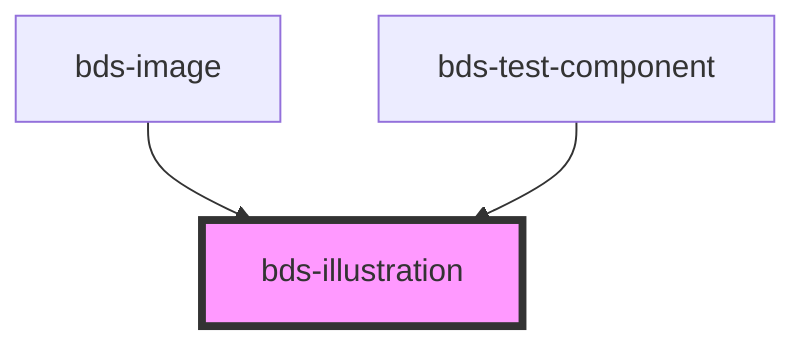

# bds-illustration

<!-- Auto Generated Below -->

## Properties

| Property   | Attribute   | Description                                                                  | Type                                                                                                                                                    | Default     |
| ---------- | ----------- | ---------------------------------------------------------------------------- | ------------------------------------------------------------------------------------------------------------------------------------------------------- | ----------- |
| `alt`      | `alt`       | Alternative text for the image.                                              | `string`                                                                                                                                                | `undefined` |
| `dataTest` | `data-test` | Data test is the prop to specifically test the component action object.      | `string`                                                                                                                                                | `null`      |
| `name`     | `name`      | Specifies the name of illustration. Verify the names on illustration tokens. | `string`                                                                                                                                                | `undefined` |
| `type`     | `type`      | Specifies the type to use. Can be: 'default'.                                | `"blip-outline" \| "blip-solid" \| "brand" \| "default" \| "empty-states" \| "logo-integration" \| "screens" \| "segmented" \| "smartphone" \| "spots"` | `'default'` |

## Dependencies

### Used by

 - [bds-image](../image)
 - [bds-test-component](../test-component)

### Graph

----------------------------------------------

*Built with [StencilJS](https://stenciljs.com/)*
