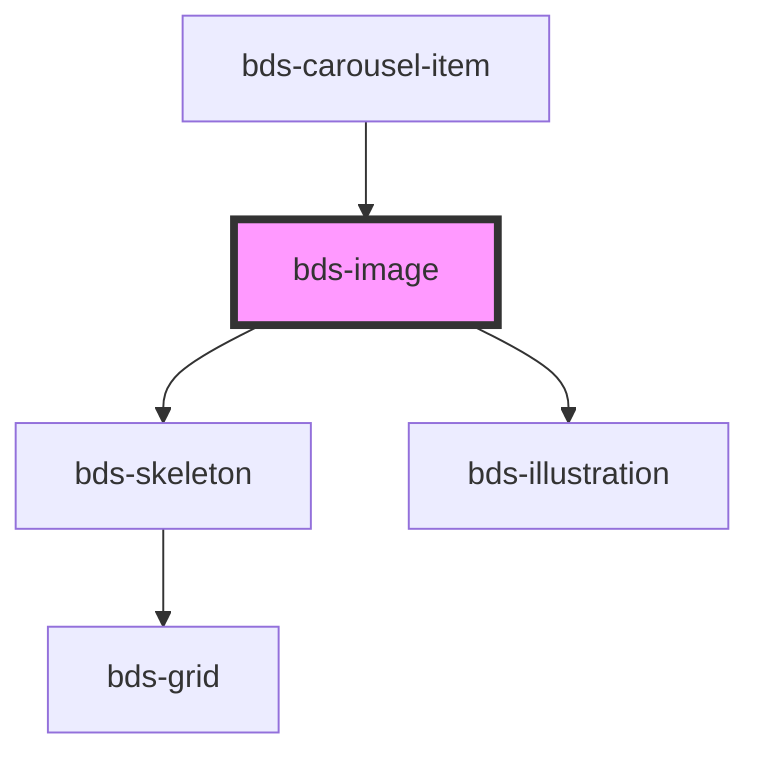

# bds-img

<!-- Auto Generated Below -->

## Properties

| Property     | Attribute    | Description                                                                                             | Type                                                       | Default     |
| ------------ | ------------ | ------------------------------------------------------------------------------------------------------- | ---------------------------------------------------------- | ----------- |
| `alt`        | `alt`        | Alternative text for the image.                                                                         | `string`                                                   | `undefined` |
| `brightness` | `brightness` | Brightness of the image.                                                                                | `number`                                                   | `undefined` |
| `dataTest`   | `data-test`  | Data test is the prop to specifically test the component action object.                                 | `string`                                                   | `null`      |
| `height`     | `height`     | Height of the image.                                                                                    | `string`                                                   | `undefined` |
| `objectFit`  | `object-fit` | Specifies the object-fit style for the image. Can be: 'fill', 'contain', 'cover', 'none', 'scale-down'. | `"contain" \| "cover" \| "fill" \| "none" \| "scale-down"` | `'cover'`   |
| `src`        | `src`        | URL of the main image.                                                                                  | `string`                                                   | `undefined` |
| `width`      | `width`      | Width of the image.                                                                                     | `string`                                                   | `undefined` |

## Methods

### `loadImage() => Promise<void>`

#### Returns

Type: `Promise<void>`

## Dependencies

### Used by

 - [bds-carousel-item](../carousel)

### Depends on

- [bds-skeleton](../skeleton)
- [bds-illustration](../illustration)

### Graph

----------------------------------------------

*Built with [StencilJS](https://stenciljs.com/)*
