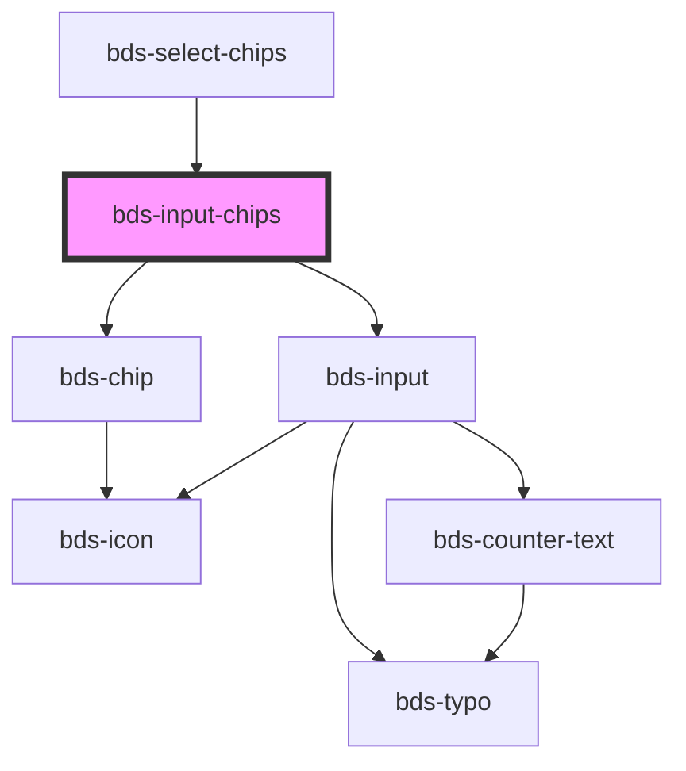

# bds-input-chips

<!-- Auto Generated Below -->

## Properties

| Property        | Attribute        | Description                                                                                                       | Type                | Default  |
| --------------- | ---------------- | ----------------------------------------------------------------------------------------------------------------- | ------------------- | -------- |
| `chips`         | --               |                                                                                                                   | `string[]`          | `[]`     |
| `danger`        | `danger`         | Add state danger on input, use for use feedback.                                                                  | `boolean`           | `false`  |
| `delimiters`    | --               | The delimiter is used to add multiple chips in the same string.                                                   | `RegExp`            | `/,\|;/` |
| `disableSubmit` | `disable-submit` | If `true`, the user cannot modify the value.                                                                      | `boolean`           | `false`  |
| `duplicated`    | `duplicated`     | Do not accept duplicate chip elements.                                                                            | `boolean`           | `true`   |
| `errorMessage`  | `error-message`  | Indicated to pass an feedback to user.                                                                            | `string`            | `''`     |
| `icon`          | `icon`           | used for add icon in input left. Uses the bds-icon component.                                                     | `string`            | `''`     |
| `label`         | `label`          | label in input, with he the input size increases.                                                                 | `string`            | `''`     |
| `type`          | `type`           | Defining the type is important so that it is possible to carry out validations. Can be one of: 'text' and 'email; | `"email" \| "text"` | `'text'` |
| `value`         | `value`          | The value of the input.                                                                                           | `string`            | `''`     |

## Events

| Event            | Description                      | Type               |
| ---------------- | -------------------------------- | ------------------ |
| `bdsBlur`        | Emitted when the chip has added. | `CustomEvent<any>` |
| `bdsChange`      | Emitted when the chip has added. | `CustomEvent<any>` |
| `bdsChangeChips` | Emitted when the chip has added. | `CustomEvent<any>` |
| `bdsSubmit`      | Emitted when the chip has added. | `CustomEvent<any>` |

## Methods

### `add(value: string) => Promise<void>`

#### Returns

Type: `Promise<void>`

### `clear() => Promise<void>`

Clear all chips

#### Returns

Type: `Promise<void>`

### `get() => Promise<string[]>`

Return the chips

#### Returns

Type: `Promise<string[]>`

### `isValid() => Promise<boolean>`

Return the validity of the input chips.

#### Returns

Type: `Promise<boolean>`

### `removeFocus() => Promise<void>`

#### Returns

Type: `Promise<void>`

### `setFocus() => Promise<void>`

#### Returns

Type: `Promise<void>`

## Dependencies

### Used by

 - [bds-select-chips](../selects/select-chips)

### Depends on

- [bds-chip](../chip)
- [bds-input](../input)

### Graph

----------------------------------------------

*Built with [StencilJS](https://stenciljs.com/)*
