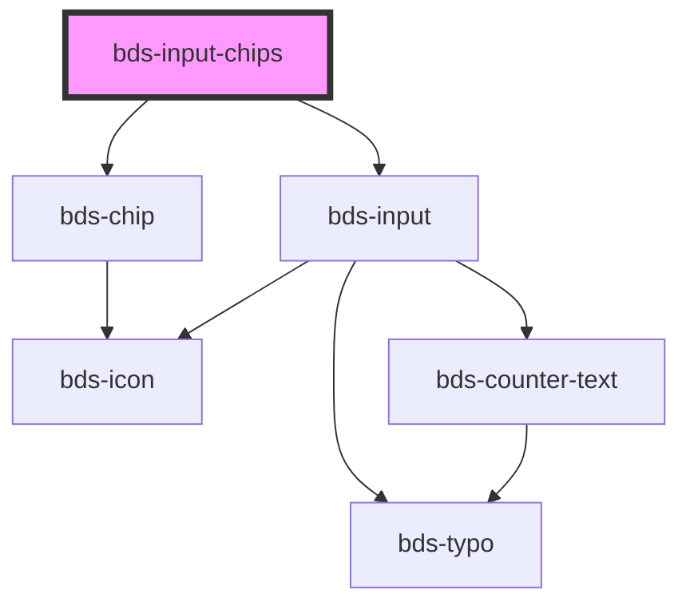

# bds-input-chips

<!-- Auto Generated Below -->

## Properties

| Property       | Attribute       | Description                                                                                                       | Type                | Default  |
| -------------- | --------------- | ----------------------------------------------------------------------------------------------------------------- | ------------------- | -------- |
| `danger`       | `danger`        | Add state danger on input, use for use feedback.                                                                  | `boolean`           | `false`  |
| `delimiter`    | `delimiter`     | The delimiter is used to add multiple chips in the same string.                                                   | `string`            | `','`    |
| `errorMessage` | `error-message` | Indicated to pass an feeback to user.                                                                             | `string`            | `''`     |
| `label`        | `label`         | label in input, with he the input size increases.                                                                 | `string`            | `''`     |
| `type`         | `type`          | Defining the type is important so that it is possible to carry out validations. Can be one of: 'text' and 'email; | `"email" \| "text"` | `'text'` |

## Events

| Event       | Description                         | Type               |
| ----------- | ----------------------------------- | ------------------ |
| `bdsChange` | Emitted when the value has changed. | `CustomEvent<any>` |

## Methods

### `get() => Promise<ChipItem[]>`

Return the chips

#### Returns

Type: `Promise<ChipItem[]>`

### `isValid() => Promise<boolean>`

Return the validity of the input chips.

#### Returns

Type: `Promise<boolean>`

## Dependencies

### Depends on

- [bds-chip](../chip)
- [bds-input](../input)

### Graph

----------------------------------------------

*Built with [StencilJS](https://stenciljs.com/)*
