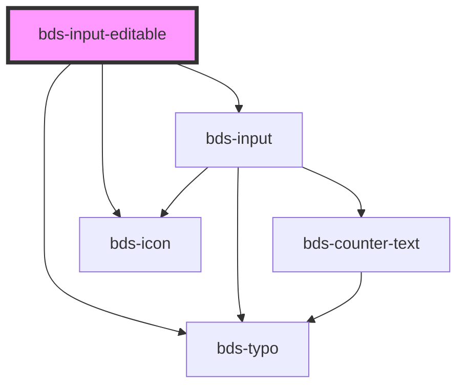

# bds-input-editable

<!-- Auto Generated Below -->

## Properties

| Property                | Attribute                 | Description                                                                                                                                                                      | Type                                                                                                                               | Default     |
| ----------------------- | ------------------------- | -------------------------------------------------------------------------------------------------------------------------------------------------------------------------------- | ---------------------------------------------------------------------------------------------------------------------------------- | ----------- |
| `danger`                | `danger`                  | Add state danger on input, use for use feedback. If true avoid save confirmation.                                                                                                | `boolean`                                                                                                                          | `false`     |
| `errorMessage`          | `error-message`           | Indicated to pass an feeback to user.                                                                                                                                            | `string`                                                                                                                           | `''`        |
| `expand`                | `expand`                  | Defines whether the input will expand. 'exp-0' \| 'exp-10' \| 'exp-20' \| 'exp-30' \| 'exp-40' \| 'exp-50' \| 'exp-60' \| 'exp-70' \| 'exp-80' \| 'exp-90' \| 'exp-100';         | `"exp-0" \| "exp-10" \| "exp-100" \| "exp-20" \| "exp-30" \| "exp-40" \| "exp-50" \| "exp-60" \| "exp-70" \| "exp-80" \| "exp-90"` | `'exp-0'`   |
| `helperMessage`         | `helper-message`          | Indicated to pass a help to the user in complex filling.                                                                                                                         | `string`                                                                                                                           | `''`        |
| `inputName`             | `input-name`              | Input Name                                                                                                                                                                       | `string`                                                                                                                           | `''`        |
| `maxlength`             | `maxlength`               | If the value of the type attribute is `text`, `email`, `search`, `password`, `tel`, or `url`, this attribute specifies the maximum number of characters that the user can enter. | `number`                                                                                                                           | `undefined` |
| `minlength`             | `minlength`               | If the value of the type attribute is `text`, `email`, `search`, `password`, `tel`, or `url`, this attribute specifies the minimum number of characters that the user can enter. | `number`                                                                                                                           | `0`         |
| `minlengthErrorMessage` | `minlength-error-message` | Error message when the value is lower than the minlength                                                                                                                         | `string`                                                                                                                           | `undefined` |
| `requiredErrorMessage`  | `required-error-message`  | Error message when input is required                                                                                                                                             | `string`                                                                                                                           | `undefined` |
| `value`                 | `value`                   | The value of the input.                                                                                                                                                          | `string`                                                                                                                           | `''`        |
| `variant`               | `variant`                 | Variant. Entered as one of the font size variant. Can be one of: 'fs-16' \| 'fs-20' \| 'fs-24' \| 'fs-32' \| 'fs-40';                                                            | `"fs-16" \| "fs-20" \| "fs-24" \| "fs-32" \| "fs-40"`                                                                              | `'fs-24'`   |

## Events

| Event                  | Description                      | Type                                    |
| ---------------------- | -------------------------------- | --------------------------------------- |
| `bdsInputEditableSave` | Emitted when input text confirm. | `CustomEvent<InputEditableEventDetail>` |

## Shadow Parts

| Part                              | Description |
| --------------------------------- | ----------- |
| `"input__editable--static__typo"` |             |

## Dependencies

### Depends on

- [bds-typo](../typo)
- [bds-icon](../icon)
- [bds-input](../input)

### Graph

----------------------------------------------

*Built with [StencilJS](https://stenciljs.com/)*
