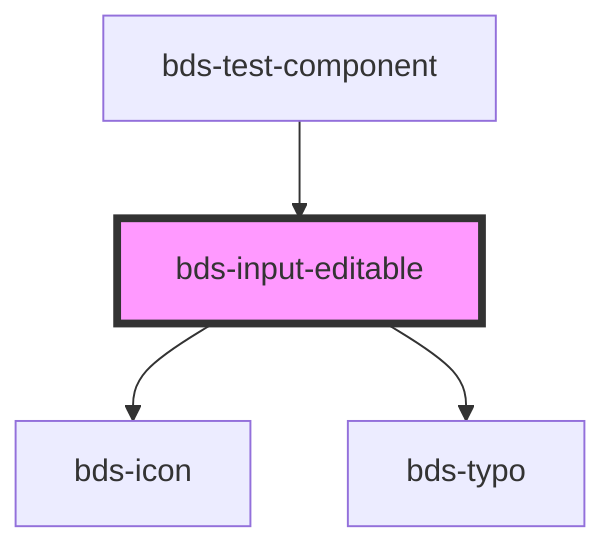

# bds-input-editable

<!-- Auto Generated Below -->

## Properties

| Property                | Attribute                 | Description                                                                                                                                                                      | Type                              | Default      |
| ----------------------- | ------------------------- | -------------------------------------------------------------------------------------------------------------------------------------------------------------------------------- | --------------------------------- | ------------ |
| `danger`                | `danger`                  | Add state danger on input, use for use feedback. If true avoid save confirmation.                                                                                                | `boolean`                         | `false`      |
| `dataTest`              | `data-test`               | Data test is the prop to specifically test the component action object.                                                                                                          | `string`                          | `null`       |
| `errorMessage`          | `error-message`           | Indicated to pass an feeback to user.                                                                                                                                            | `string`                          | `''`         |
| `expand`                | `expand`                  | Defines whether the component will be expandable                                                                                                                                 | `boolean`                         | `false`      |
| `helperMessage`         | `helper-message`          | Indicated to pass a help to the user in complex filling.                                                                                                                         | `string`                          | `''`         |
| `inputName`             | `input-name`              | Input Name                                                                                                                                                                       | `string`                          | `''`         |
| `maxlength`             | `maxlength`               | If the value of the type attribute is `text`, `email`, `search`, `password`, `tel`, or `url`, this attribute specifies the maximum number of characters that the user can enter. | `number`                          | `undefined`  |
| `minlength`             | `minlength`               | If the value of the type attribute is `text`, `email`, `search`, `password`, `tel`, or `url`, this attribute specifies the minimum number of characters that the user can enter. | `number`                          | `0`          |
| `minlengthErrorMessage` | `minlength-error-message` | Error message when the value is lower than the minlength                                                                                                                         | `string`                          | `undefined`  |
| `placeholder`           | `placeholder`             | Placeholder for native input element.                                                                                                                                            | `string`                          | `''`         |
| `requiredErrorMessage`  | `required-error-message`  | Error message when input is required                                                                                                                                             | `string`                          | `undefined`  |
| `size`                  | `size`                    | Set the component size. Can be one of: 'short' \| 'standard' \| 'tall';                                                                                                          | `"short" \| "standard" \| "tall"` | `'standard'` |
| `value`                 | `value`                   | The value of the input.                                                                                                                                                          | `string`                          | `''`         |

## Events

| Event                  | Description                              | Type                                    |
| ---------------------- | ---------------------------------------- | --------------------------------------- |
| `bdsBlur`              | Emitted when the select loses focus.     | `CustomEvent<void>`                     |
| `bdsCancel`            | Emitted when the selection is cancelled. | `CustomEvent<void>`                     |
| `bdsChange`            | Emitted when the value has changed.      | `CustomEvent<InputEditableEventDetail>` |
| `bdsFocus`             | Emitted when the select loses focus.     | `CustomEvent<void>`                     |
| `bdsInput`             | Emitted when the input has changed.      | `CustomEvent<KeyboardEvent>`            |
| `bdsInputEditableSave` | Emitted when input text confirm.         | `CustomEvent<InputEditableEventDetail>` |

## Shadow Parts

| Part                              | Description |
| --------------------------------- | ----------- |
| `"input"`                         |             |
| `"input__editable--static__typo"` |             |
| `"input__message"`                |             |

## Dependencies

### Used by

 - [bds-test-component](../test-component)

### Depends on

- [bds-icon](../icon)
- [bds-typo](../typo)

### Graph

----------------------------------------------

*Built with [StencilJS](https://stenciljs.com/)*
