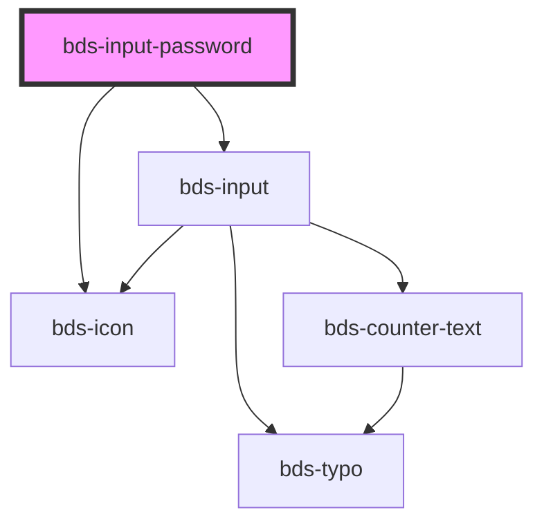

# bds-input-password

<!-- Auto Generated Below -->

## Properties

| Property         | Attribute         | Description                                                                                                                                                                      | Type                                                                  | Default     |
| ---------------- | ----------------- | -------------------------------------------------------------------------------------------------------------------------------------------------------------------------------- | --------------------------------------------------------------------- | ----------- |
| `autoCapitalize` | `auto-capitalize` | Capitalizes every word's second character.                                                                                                                                       | `"characters" \| "none" \| "off" \| "on" \| "sentences" \| "words"`   | `'off'`     |
| `autoComplete`   | `auto-complete`   | Hint for form autofill feature                                                                                                                                                   | `"current-password" \| "new-password" \| "off" \| "on" \| "username"` | `'off'`     |
| `danger`         | `danger`          | Add state danger on input, use for use feedback.                                                                                                                                 | `boolean`                                                             | `false`     |
| `dataTest`       | `data-test`       | Data test is the prop to specifically test the component action object.                                                                                                          | `string`                                                              | `null`      |
| `disabled`       | `disabled`        | Disabled input.                                                                                                                                                                  | `boolean`                                                             | `false`     |
| `errorMessage`   | `error-message`   | Indicated to pass an feeback to user.                                                                                                                                            | `string`                                                              | `''`        |
| `helperMessage`  | `helper-message`  | Indicated to pass a help the user in complex filling.                                                                                                                            | `string`                                                              | `''`        |
| `icon`           | `icon`            | used for add icon in input left. Uses the bds-icon component.                                                                                                                    | `string`                                                              | `''`        |
| `inputName`      | `input-name`      | Input Name                                                                                                                                                                       | `string`                                                              | `''`        |
| `label`          | `label`           | label in input, with he the input size increases.                                                                                                                                | `string`                                                              | `''`        |
| `max`            | `max`             | The maximum value, which must not be less than its minimum (min attribute) value.                                                                                                | `string`                                                              | `undefined` |
| `maxlength`      | `maxlength`       | If the value of the type attribute is `text`, `email`, `search`, `password`, `tel`, or `url`, this attribute specifies the maximum number of characters that the user can enter. | `number`                                                              | `undefined` |
| `min`            | `min`             | The minimum value, which must not be greater than its maximum (max attribute) value.                                                                                             | `string`                                                              | `undefined` |
| `minlength`      | `minlength`       | If the value of the type attribute is `text`, `email`, `search`, `password`, `tel`, or `url`, this attribute specifies the minimum number of characters that the user can enter. | `number`                                                              | `undefined` |
| `openEyes`       | `open-eyes`       |                                                                                                                                                                                  | `boolean`                                                             | `false`     |
| `placeholder`    | `placeholder`     | A tip for the user who can enter no controls.                                                                                                                                    | `string`                                                              | `''`        |
| `readonly`       | `readonly`        | If `true`, the user cannot modify the value.                                                                                                                                     | `boolean`                                                             | `false`     |
| `value`          | `value`           | The value of the input.                                                                                                                                                          | `string`                                                              | `''`        |

## Dependencies

### Depends on

- [bds-input](../input)
- [bds-icon](../icon)

### Graph

----------------------------------------------

*Built with [StencilJS](https://stenciljs.com/)*
