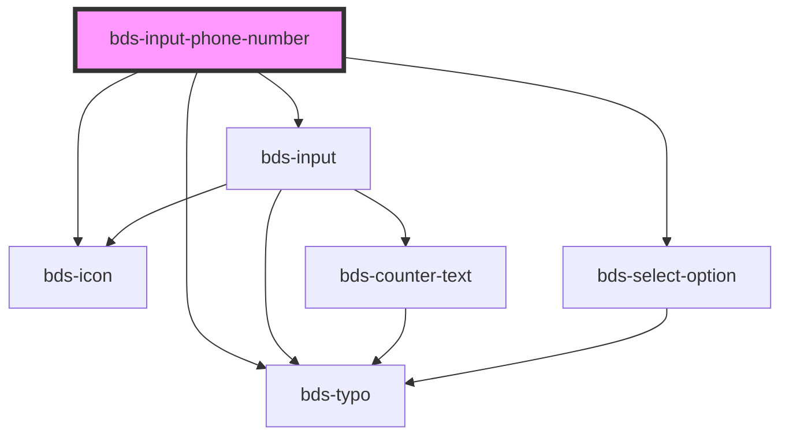

# bds-input-phone-number

<!-- Auto Generated Below -->

## Properties

| Property               | Attribute                | Description                                                   | Type       | Default          |
| ---------------------- | ------------------------ | ------------------------------------------------------------- | ---------- | ---------------- |
| `danger`               | `danger`                 | Add state danger on input, use for use feedback.              | `boolean`  | `false`          |
| `disabled`             | `disabled`               | Disabled input.                                               | `boolean`  | `false`          |
| `icon`                 | `icon`                   | used for add icon in input left. Uses the bds-icon component. | `string`   | `''`             |
| `label`                | `label`                  | label in input, with he the input size increases.             | `string`   | `'Phone number'` |
| `numberErrorMessage`   | `number-error-message`   | Error message when input is required                          | `string`   | `undefined`      |
| `options`              | --                       |                                                               | `Option[]` | `[]`             |
| `required`             | `required`               | If `true`, the input value will be required.                  | `boolean`  | `undefined`      |
| `requiredErrorMessage` | `required-error-message` | Error message when input is required                          | `string`   | `undefined`      |
| `text`                 | `text`                   |                                                               | `string`   | `''`             |
| `value`                | `value`                  | the value of the select.                                      | `any`      | `'+55'`          |

## Events

| Event                  | Description                              | Type                                   |
| ---------------------- | ---------------------------------------- | -------------------------------------- |
| `bdsBlur`              | Emitted when the select loses focus.     | `CustomEvent<void>`                    |
| `bdsCancel`            | Emitted when the selection is cancelled. | `CustomEvent<void>`                    |
| `bdsFocus`             | Emitted when the select loses focus.     | `CustomEvent<void>`                    |
| `bdsPhoneNumberChange` | Emitted when the value has changed.      | `CustomEvent<SelectChangeEventDetail>` |

## Dependencies

### Depends on

- [bds-input](../input)
- [bds-icon](../icon)
- [bds-typo](../typo)
- [bds-select-option](../select-option)

### Graph

----------------------------------------------

*Built with [StencilJS](https://stenciljs.com/)*
