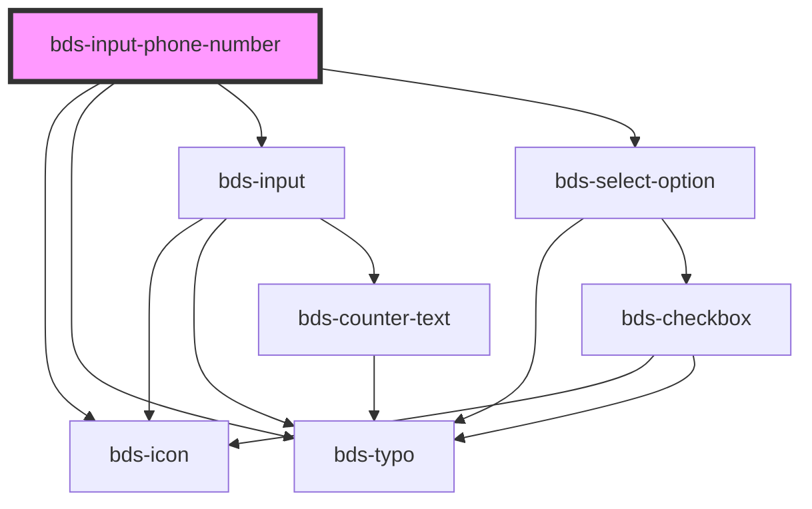

# bds-input-phone-number

<!-- Auto Generated Below -->

## Properties

| Property               | Attribute                | Description                                                                                                                                     | Type                            | Default                 |
| ---------------------- | ------------------------ | ----------------------------------------------------------------------------------------------------------------------------------------------- | ------------------------------- | ----------------------- |
| `danger`               | `danger`                 | Habilita o estado "danger" no input.                                                                                                            | `boolean`                       | `false`                 |
| `dataTest`             | `data-test`              | Data-test para identificar o componente.                                                                                                        | `string`                        | `null`                  |
| `disabled`             | `disabled`               | Desabilita o input.                                                                                                                             | `boolean`                       | `false`                 |
| `dtSelectFlag`         | `dt-select-flag`         | Data-test para o botão de seleção de bandeira.                                                                                                  | `string`                        | `null`                  |
| `enableSearch`         | `enable-search`          | Habilita funcionalidade de busca no dropdown de países.                                                                                         | `boolean`                       | `false`                 |
| `errorMessage`         | `error-message`          | Mensagem de erro a ser exibida.                                                                                                                 | `string`                        | `''`                    |
| `helperMessage`        | `helper-message`         | Mensagem de ajuda para o usuário.                                                                                                               | `string`                        | `''`                    |
| `icon`                 | `icon`                   | Ícone à esquerda do input.                                                                                                                      | `string`                        | `''`                    |
| `initialCountryFlag`   | `initial-country-flag`   | Define o país inicial pelo nome da bandeira (ex: "brazil-flag", "united-states-flag"). Tem prioridade sobre o valor padrão quando especificado. | `string`                        | `undefined`             |
| `initialIsoCode`       | `initial-iso-code`       | Define o país inicial pelo código ISO (ex: "BR", "US", "BR / BRA"). Tem prioridade sobre o valor padrão quando especificado.                    | `string`                        | `undefined`             |
| `label`                | `label`                  | Label do input.                                                                                                                                 | `string`                        | `'Phone number'`        |
| `language`             | `language`               | Valores possíveis: "pt_BR", "en_US", "es_ES". Se nenhum for informado, utiliza o arquivo padrão (countries.json).                               | `"en_US" \| "es_ES" \| "pt_BR"` | `'pt_BR'`               |
| `numberErrorMessage`   | `number-error-message`   | Mensagem de erro para validação numérica.                                                                                                       | `string`                        | `undefined`             |
| `options`              | --                       | Lista de opções do select.                                                                                                                      | `Option[]`                      | `[]`                    |
| `required`             | `required`               | Se `true`, o valor do input será obrigatório.                                                                                                   | `boolean`                       | `undefined`             |
| `requiredErrorMessage` | `required-error-message` | Mensagem de erro para campo obrigatório.                                                                                                        | `string`                        | `undefined`             |
| `searchPlaceholder`    | `search-placeholder`     | Texto placeholder para o campo de busca.                                                                                                        | `string`                        | `'Search countries...'` |
| `success`              | `success`                | Habilita o estado "success" no input.                                                                                                           | `boolean`                       | `false`                 |
| `successMessage`       | `success-message`        | Mensagem de sucesso a ser exibida.                                                                                                              | `string`                        | `''`                    |
| `text`                 | `text`                   | Valor do input de telefone.                                                                                                                     | `string`                        | `''`                    |
| `value`                | `value`                  | Valor do select.                                                                                                                                | `string`                        | `'+55'`                 |

## Events

| Event                  | Description                                      | Type                         |
| ---------------------- | ------------------------------------------------ | ---------------------------- |
| `bdsBlur`              | Evento disparado quando o select perde o foco.   | `CustomEvent<void>`          |
| `bdsCancel`            | Evento disparado quando a seleção é cancelada.   | `CustomEvent<void>`          |
| `bdsFocus`             | Evento disparado quando o select ganha foco.     | `CustomEvent<void>`          |
| `bdsInput`             | Evento disparado quando o input sofre alteração. | `CustomEvent<KeyboardEvent>` |
| `bdsPhoneNumberChange` | Evento disparado quando o valor é alterado.      | `CustomEvent<any>`           |

## Methods

### `changeCountry(code: any, isoCode: any, flag: any) => Promise<void>`

#### Returns

Type: `Promise<void>`

### `filterCountries(term: string) => Promise<void>`

#### Returns

Type: `Promise<void>`

### `getIsoCode() => Promise<string>`

#### Returns

Type: `Promise<string>`

### `getSelectedCountry() => Promise<string>`

#### Returns

Type: `Promise<string>`

### `removeFocus() => Promise<void>`

#### Returns

Type: `Promise<void>`

## Dependencies

### Depends on

- [bds-icon](../icon)
- [bds-typo](../typo)
- [bds-input](../input)
- [bds-select-option](../select-option)

### Graph

----------------------------------------------

*Built with [StencilJS](https://stenciljs.com/)*
