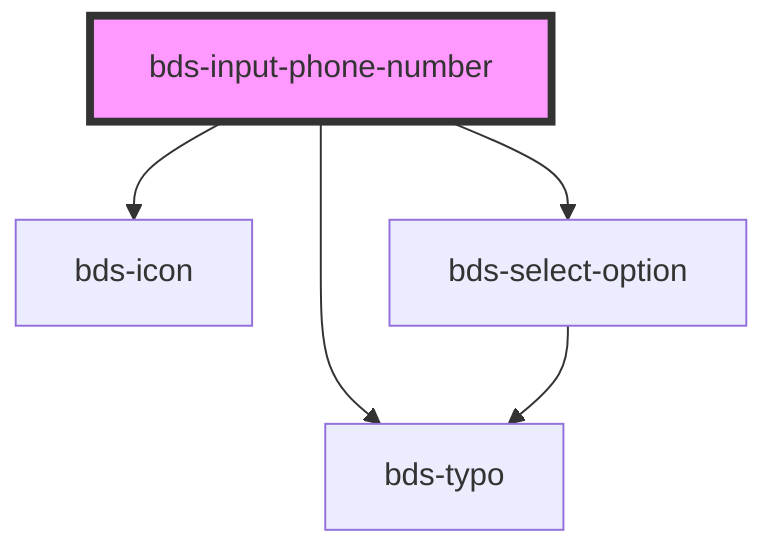

# bds-input-phone-number

<!-- Auto Generated Below -->

## Properties

| Property               | Attribute                | Description                                                             | Type       | Default          |
| ---------------------- | ------------------------ | ----------------------------------------------------------------------- | ---------- | ---------------- |
| `danger`               | `danger`                 | Add state danger on input, use for use feedback.                        | `boolean`  | `false`          |
| `dataTest`             | `data-test`              | Data test is the prop to specifically test the component action object. | `string`   | `null`           |
| `disabled`             | `disabled`               | Disabled input.                                                         | `boolean`  | `false`          |
| `errorMessage`         | `error-message`          | Indicated to pass an feeback to user.                                   | `string`   | `''`             |
| `helperMessage`        | `helper-message`         | Indicated to pass a help the user in complex filling.                   | `string`   | `''`             |
| `icon`                 | `icon`                   | used for add icon in input left. Uses the bds-icon component.           | `string`   | `''`             |
| `label`                | `label`                  | label in input, with he the input size increases.                       | `string`   | `'Phone number'` |
| `numberErrorMessage`   | `number-error-message`   | Error message when input is required                                    | `string`   | `undefined`      |
| `options`              | --                       | The options of select.                                                  | `Option[]` | `[]`             |
| `required`             | `required`               | If `true`, the input value will be required.                            | `boolean`  | `undefined`      |
| `requiredErrorMessage` | `required-error-message` | Error message when input is required                                    | `string`   | `undefined`      |
| `success`              | `success`                | Add state success on input, use for use feedback.                       | `boolean`  | `false`          |
| `successMessage`       | `success-message`        | Indicated to pass an feeback to user.                                   | `string`   | `''`             |
| `text`                 | `text`                   | The value of the phone number input.                                    | `string`   | `''`             |
| `value`                | `value`                  | the value of the select.                                                | `string`   | `'+55'`          |

## Events

| Event                  | Description                              | Type                         |
| ---------------------- | ---------------------------------------- | ---------------------------- |
| `bdsBlur`              | Emitted when the select loses focus.     | `CustomEvent<void>`          |
| `bdsCancel`            | Emitted when the selection is cancelled. | `CustomEvent<void>`          |
| `bdsFocus`             | Emitted when the select loses focus.     | `CustomEvent<void>`          |
| `bdsInput`             | Emitted when the input has changed.      | `CustomEvent<KeyboardEvent>` |
| `bdsPhoneNumberChange` | Emitted when the value has changed.      | `CustomEvent<any>`           |

## Methods

### `changeCountry(code: any, isoCode: any, flag: any) => Promise<void>`

#### Returns

Type: `Promise<void>`

### `removeFocus() => Promise<void>`

#### Returns

Type: `Promise<void>`

## Shadow Parts

| Part                | Description |
| ------------------- | ----------- |
| `"input-container"` |             |
| `"input__message"`  |             |

## Dependencies

### Depends on

- [bds-icon](../icon)
- [bds-typo](../typo)
- [bds-select-option](../select-option)

### Graph

----------------------------------------------

*Built with [StencilJS](https://stenciljs.com/)*
