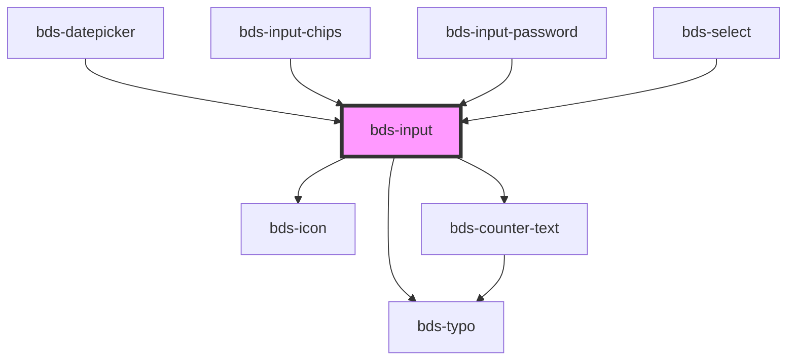

# bds-input

<!-- Auto Generated Below -->

## Properties

| Property                | Attribute                 | Description                                                                                                                                                                      | Type                                                                  | Default     |
| ----------------------- | ------------------------- | -------------------------------------------------------------------------------------------------------------------------------------------------------------------------------- | --------------------------------------------------------------------- | ----------- |
| `autoCapitalize`        | `auto-capitalize`         | Capitalizes every word's second character.                                                                                                                                       | `"characters" \| "none" \| "off" \| "on" \| "sentences" \| "words"`   | `'off'`     |
| `autoComplete`          | `auto-complete`           | Hint for form autofill feature                                                                                                                                                   | `"current-password" \| "new-password" \| "off" \| "on" \| "username"` | `'off'`     |
| `chips`                 | `chips`                   | Internal prop to identify input chips                                                                                                                                            | `boolean`                                                             | `undefined` |
| `cols`                  | `cols`                    | The rows and cols attributes allow you to specify an exact size for the <textarea> to get. Setting this is a good idea for consistency, as the browser defaults may differ.      | `number`                                                              | `0`         |
| `counterLength`         | `counter-length`          | Passing true to display a counter of available size, it is necessary to pass another maxlength property.                                                                         | `boolean`                                                             | `false`     |
| `counterLengthRule`     | --                        | Make it possible to pass the base values to the warning level and exclude, using the values between min and max.                                                                 | `{ warning: CounterTextRule; delete: CounterTextRule; }`              | `null`      |
| `danger`                | `danger`                  | Add state danger on input, use for use feedback.                                                                                                                                 | `boolean`                                                             | `false`     |
| `dataTest`              | `data-test`               | Id to support Cypress.                                                                                                                                                           | `string`                                                              | `null`      |
| `disabled`              | `disabled`                | Disabled input.                                                                                                                                                                  | `boolean`                                                             | `false`     |
| `emailErrorMessage`     | `email-error-message`     | Error message when the value isn't an email                                                                                                                                      | `string`                                                              | `undefined` |
| `errorMessage`          | `error-message`           | Indicated to pass an feeback to user.                                                                                                                                            | `string`                                                              | `''`        |
| `helperMessage`         | `helper-message`          | Indicated to pass a help the user in complex filling.                                                                                                                            | `string`                                                              | `''`        |
| `icon`                  | `icon`                    | used for add icon in input left. Uses the bds-icon component.                                                                                                                    | `string`                                                              | `''`        |
| `inputName`             | `input-name`              | Input Name                                                                                                                                                                       | `string`                                                              | `''`        |
| `isSubmit`              | `is-submit`               | If `true`, the user cannot modify the value.                                                                                                                                     | `boolean`                                                             | `false`     |
| `isTextarea`            | `is-textarea`             | if `true` input switched to textarea                                                                                                                                             | `boolean`                                                             | `false`     |
| `label`                 | `label`                   | label in input, with he the input size increases.                                                                                                                                | `string`                                                              | `''`        |
| `max`                   | `max`                     | The maximum value, which must not be less than its minimum (min attribute) value.                                                                                                | `string`                                                              | `undefined` |
| `maxErrorMessage`       | `max-error-message`       | Error message when the value is higher than the max value                                                                                                                        | `string`                                                              | `undefined` |
| `maxlength`             | `maxlength`               | If the value of the type attribute is `text`, `email`, `search`, `password`, `tel`, or `url`, this attribute specifies the maximum number of characters that the user can enter. | `number`                                                              | `undefined` |
| `min`                   | `min`                     | The minimum value, which must not be greater than its maximum (max attribute) value.                                                                                             | `string`                                                              | `undefined` |
| `minErrorMessage`       | `min-error-message`       | Error message when the value is lower than the min value                                                                                                                         | `string`                                                              | `undefined` |
| `minlength`             | `minlength`               | If the value of the type attribute is `text`, `email`, `search`, `password`, `tel`, or `url`, this attribute specifies the minimum number of characters that the user can enter. | `number`                                                              | `undefined` |
| `minlengthErrorMessage` | `minlength-error-message` | Error message when the value is lower than the minlength                                                                                                                         | `string`                                                              | `undefined` |
| `numberErrorMessage`    | `number-error-message`    | Error message when the value isn't an email                                                                                                                                      | `string`                                                              | `undefined` |
| `pattern`               | `pattern`                 | Indicated to pass a regex pattern to input                                                                                                                                       | `string`                                                              | `undefined` |
| `placeholder`           | `placeholder`             | A tip for the user who can enter no controls.                                                                                                                                    | `string`                                                              | `''`        |
| `readonly`              | `readonly`                | If `true`, the user cannot modify the value.                                                                                                                                     | `boolean`                                                             | `false`     |
| `required`              | `required`                | If `true`, the input value will be required.                                                                                                                                     | `boolean`                                                             | `undefined` |
| `requiredErrorMessage`  | `required-error-message`  | Error message when input is required                                                                                                                                             | `string`                                                              | `undefined` |
| `rows`                  | `rows`                    | The rows and cols attributes allow you to specify an exact size for the <textarea> to get. Setting this is a good idea for consistency, as the browser defaults may differ.      | `number`                                                              | `1`         |
| `type`                  | `type`                    | Input type. Can be one of: "text", "password", "number" or "email".                                                                                                              | `"email" \| "number" \| "password" \| "phonenumber" \| "text"`        | `'text'`    |
| `value`                 | `value`                   | The value of the input.                                                                                                                                                          | `string`                                                              | `''`        |

## Events

| Event                 | Description                         | Type                         |
| --------------------- | ----------------------------------- | ---------------------------- |
| `bdsChange`           | Emitted when the value has changed. | `CustomEvent<any>`           |
| `bdsFocus`            | Event input focus.                  | `CustomEvent<any>`           |
| `bdsInput`            | Emitted when the input has changed. | `CustomEvent<KeyboardEvent>` |
| `bdsKeyDownBackspace` | Event input key down backspace.     | `CustomEvent<any>`           |
| `bdsOnBlur`           | Event input onblur.                 | `CustomEvent<any>`           |
| `bdsSubmit`           | Event input enter.                  | `CustomEvent<any>`           |

## Methods

### `clear() => Promise<void>`

Return the validity of the input.

#### Returns

Type: `Promise<void>`

### `getInputElement() => Promise<HTMLInputElement>`

Returns the native `<input>` element used under the hood.

#### Returns

Type: `Promise<HTMLInputElement>`

### `isValid() => Promise<boolean>`

Return the validity of the input.

#### Returns

Type: `Promise<boolean>`

### `removeFocus() => Promise<void>`

#### Returns

Type: `Promise<void>`

### `setFocus() => Promise<void>`

Sets focus on the specified `ion-input`. Use this method instead of the global
`input.focus()`.

#### Returns

Type: `Promise<void>`

## Shadow Parts

| Part                | Description |
| ------------------- | ----------- |
| `"input"`           |             |
| `"input-container"` |             |
| `"input__message"`  |             |

## Dependencies

### Used by

 - [bds-datepicker](../datepicker)
 - [bds-input-chips](../input-chips)
 - [bds-input-password](../input-password)
 - [bds-select](../selects/select)

### Depends on

- [bds-icon](../icon)
- [bds-typo](../typo)
- [bds-counter-text](../counter-text)

### Graph

----------------------------------------------

*Built with [StencilJS](https://stenciljs.com/)*
