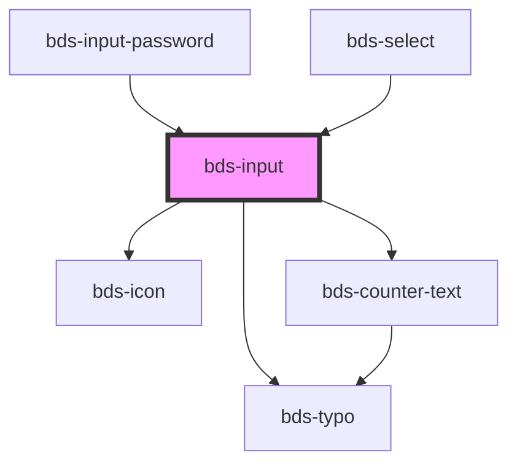

# bds-input

<!-- Auto Generated Below -->

## Properties

| Property            | Attribute         | Description                                                                                                                                                                      | Type                                                                  | Default     |
| ------------------- | ----------------- | -------------------------------------------------------------------------------------------------------------------------------------------------------------------------------- | --------------------------------------------------------------------- | ----------- |
| `autoCapitalize`    | `auto-capitalize` | Capitalizes every word's second character.                                                                                                                                       | `"characters" or "none" or "off" or "on" or "sentences" or "words"`   | `'off'`     |
| `autoComplete`      | `auto-complete`   | Hint for form autofill feature                                                                                                                                                   | `"current-password" or "new-password" or "off" or "on" or "username"` | `'off'`     |
| `counterLength`     | `counter-length`  | Passing true to display a counter of available size, it is necessary to pass another maxlength property.                                                                         | `boolean`                                                             | `false`     |
| `counterLengthRule` | --                | Make it possible to pass the base values to the warning level and exclude, using the values between min and max.                                                                 | `{ warning: CounterTextRule; delete: CounterTextRule; } or {}`        | `{}`        |
| `danger`            | `danger`          | Add state danger on input, use for use feedback.                                                                                                                                 | `boolean`                                                             | `false`     |
| `disabled`          | `disabled`        | Disabled input.                                                                                                                                                                  | `boolean`                                                             | `false`     |
| `errorMessage`      | `error-message`   | Indicated to pass an feeback to user.                                                                                                                                            | `string`                                                              | `''`        |
| `helperMessage`     | `helper-message`  | Indicated to pass a help the user in complex filling.                                                                                                                            | `string`                                                              | `''`        |
| `icon`              | `icon`            | used for add icon in input left. Uses the bds-icon component.                                                                                                                    | `string`                                                              | `''`        |
| `inputName`         | `input-name`      | Input Name                                                                                                                                                                       | `string`                                                              | `''`        |
| `label`             | `label`           | label in input, with he the input size increases.                                                                                                                                | `string`                                                              | `''`        |
| `max`               | `max`             | The maximum value, which must not be less than its minimum (min attribute) value.                                                                                                | `string`                                                              | `undefined` |
| `maxlength`         | `maxlength`       | If the value of the type attribute is `text`, `email`, `search`, `password`, `tel`, or `url`, this attribute specifies the maximum number of characters that the user can enter. | `number`                                                              | `undefined` |
| `min`               | `min`             | The minimum value, which must not be greater than its maximum (max attribute) value.                                                                                             | `string`                                                              | `undefined` |
| `minlength`         | `minlength`       | If the value of the type attribute is `text`, `email`, `search`, `password`, `tel`, or `url`, this attribute specifies the minimum number of characters that the user can enter. | `number`                                                              | `undefined` |
| `placeholder`       | `placeholder`     | A tip for the user who can enter no controls.                                                                                                                                    | `string`                                                              | `''`        |
| `readonly`          | `readonly`        | If `true`, the user cannot modify the value.                                                                                                                                     | `boolean`                                                             | `false`     |
| `type`              | `type`            | Input type. Can be one of: "text" or "password".                                                                                                                                 | `"password" or "text"`                                                | `'text'`    |
| `value`             | `value`           | The value of the input.                                                                                                                                                          | `string`                                                              | `''`        |

## Events

| Event       | Description                         | Type                         |
| ----------- | ----------------------------------- | ---------------------------- |
| `bdsChange` | Emitted when the value has changed. | `CustomEvent<any>`           |
| `bdsFocus`  | Event input focus.                  | `CustomEvent<any>`           |
| `bdsInput`  | Emitted when the input has changed. | `CustomEvent<KeyboardEvent>` |
| `bdsOnBlur` | Event input onblur.                 | `CustomEvent<any>`           |

## Methods

### `getInputElement() => Promise<HTMLInputElement>`

Returns the native `<input>` element used under the hood.

#### Returns

Type: `Promise<HTMLInputElement>`

### `removeFocus() => Promise<void>`

#### Returns

Type: `Promise<void>`

### `setFocus() => Promise<void>`

Sets focus on the specified `ion-input`. Use this method instead of the global
`input.focus()`.

#### Returns

Type: `Promise<void>`

## Dependencies

### Used by

 - [bds-input-password](../input-password)
 - [bds-select](../select)

### Depends on

- [bds-icon](../icon)
- [bds-typo](../typo)
- [bds-counter-text](../counter-text)

### Graph

----------------------------------------------

*Built with [StencilJS](https://stenciljs.com/)*
