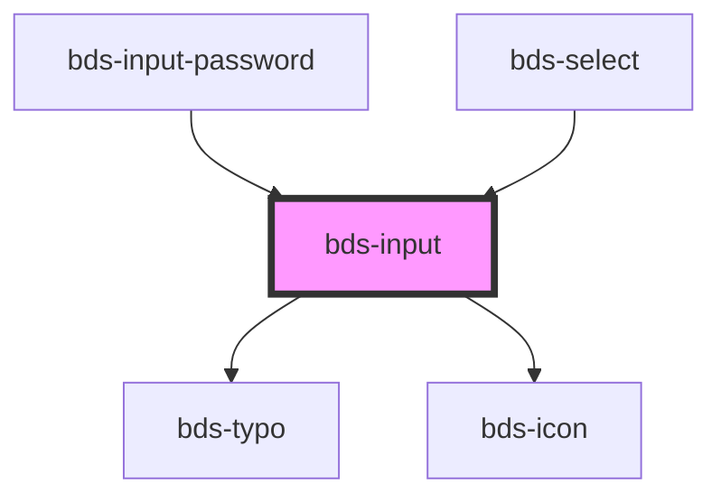

# bds-input

<!-- Auto Generated Below -->

## Properties

| Property         | Attribute         | Description                                                   | Type                                                                  | Default   |
| ---------------- | ----------------- | ------------------------------------------------------------- | --------------------------------------------------------------------- | --------- |
| `autoCapitalize` | `auto-capitalize` | Capitalizes every word's second character.                    | `"characters" \| "none" \| "off" \| "on" \| "sentences" \| "words"`   | `'off'`   |
| `autoComplete`   | `auto-complete`   | Hint for form autofill feature                                | `"current-password" \| "new-password" \| "off" \| "on" \| "username"` | `'off'`   |
| `danger`         | `danger`          | Add state danger on input, use for use feedback.              | `boolean`                                                             | `false`   |
| `disabled`       | `disabled`        | Disabled input.                                               | `boolean`                                                             | `false`   |
| `errorMessage`   | `error-message`   | Indicated to pass an feeback to user.                         | `string`                                                              | `''`      |
| `helperMessage`  | `helper-message`  | Indicated to pass a help the user in complex filling.         | `string`                                                              | `''`      |
| `icon`           | `icon`            | used for add icon in input left. Uses the bds-icon component. | `string`                                                              | `''`      |
| `inputName`      | `input-name`      | Input Name                                                    | `string`                                                              | `''`      |
| `interface`      | `interface`       |                                                               | `"input" \| "text"`                                                   | `'input'` |
| `label`          | `label`           | label in input, with he the input size increases.             | `string`                                                              | `''`      |
| `placeholder`    | `placeholder`     | A tip for the user who can enter no controls.                 | `string`                                                              | `''`      |
| `type`           | `type`            | Input type. Can be one of: "text" or "password".              | `"password" \| "text"`                                                | `'text'`  |
| `value`          | `value`           | The value of the input.                                       | `string`                                                              | `''`      |

## Events

| Event       | Description                         | Type                         |
| ----------- | ----------------------------------- | ---------------------------- |
| `bdsChange` | Emitted when the value has changed. | `CustomEvent<any>`           |
| `bdsInput`  | Emitted when the input has changed. | `CustomEvent<KeyboardEvent>` |

## Methods

### `getInputElement() => Promise<HTMLInputElement>`

Returns the native `<input>` element used under the hood.

#### Returns

Type: `Promise<HTMLInputElement>`

### `setFocus() => Promise<void>`

Sets focus on the specified `ion-input`. Use this method instead of the global
`input.focus()`.

#### Returns

Type: `Promise<void>`

## Dependencies

### Used by

 - [bds-input-password](../input-password)
 - [bds-select](../select)

### Depends on

- [bds-typo](../typo)
- [bds-icon](../icon)

### Graph

----------------------------------------------

*Built with [StencilJS](https://stenciljs.com/)*
