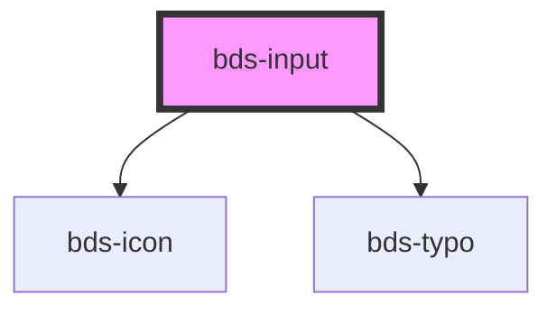

# bds-input

<!-- Auto Generated Below -->

## Properties

| Property               | Attribute         | Description                                                   | Type                                                                  | Default     |
| ---------------------- | ----------------- | ------------------------------------------------------------- | --------------------------------------------------------------------- | ----------- |
| `autoCapitalize`       | `auto-capitalize` | Capitalizes every word's second character.                    | `"characters" \| "none" \| "off" \| "on" \| "sentences" \| "words"`   | `'off'`     |
| `autoComplete`         | `auto-complete`   | Hint for form autofill feature                                | `"current-password" \| "new-password" \| "off" \| "on" \| "username"` | `'off'`     |
| `danger`               | `danger`          | Add state danger on input, use for use feedback.              | `boolean`                                                             | `false`     |
| `disabled`             | `disabled`        | Disabled input.                                               | `boolean`                                                             | `false`     |
| `errorMessage`         | `error-message`   | Indicated to pass an feeback to user.                         | `string`                                                              | `''`        |
| `helperMessage`        | `helper-message`  | Indicated to pass a help the user in complex filling.         | `string`                                                              | `''`        |
| `icon`                 | `icon`            | used for add icon in input left. Uses the bds-icon component. | `string`                                                              | `''`        |
| `inputId` _(required)_ | `input-id`        | Input Id                                                      | `string`                                                              | `undefined` |
| `inputName`            | `input-name`      | Input Name                                                    | `string`                                                              | `''`        |
| `label`                | `label`           | label in input, with he the input size increases.             | `string`                                                              | `''`        |
| `onChangeValue`        | --                |                                                               | `Function`                                                            | `undefined` |
| `placeholder`          | `placeholder`     | A tip for the user who can enter no controls.                 | `string`                                                              | `''`        |
| `type`                 | `type`            | Input type. Can be one of: "text" or "password".              | `"password" \| "text"`                                                | `'text'`    |
| `value`                | `value`           | Input value.                                                  | `string`                                                              | `''`        |

## Dependencies

### Depends on

- [bds-icon](../icon)
- [bds-typo](../typo)

### Graph

----------------------------------------------

*Built with [StencilJS](https://stenciljs.com/)*
