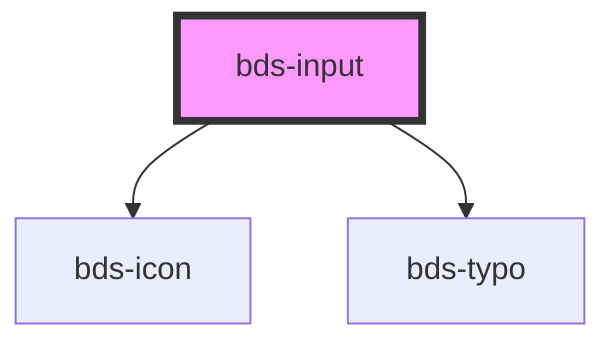

# bds-input

<!-- Auto Generated Below -->

## Properties

| Property               | Attribute         | Description | Type                                                                  | Default     |
| ---------------------- | ----------------- | ----------- | --------------------------------------------------------------------- | ----------- |
| `autoCapitalize`       | `auto-capitalize` |             | `"characters" \| "none" \| "off" \| "on" \| "sentences" \| "words"`   | `'off'`     |
| `autoComplete`         | `auto-complete`   |             | `"current-password" \| "new-password" \| "off" \| "on" \| "username"` | `'off'`     |
| `danger`               | `danger`          |             | `boolean`                                                             | `false`     |
| `disabled`             | `disabled`        |             | `boolean`                                                             | `false`     |
| `errorMessage`         | `error-message`   |             | `string`                                                              | `''`        |
| `helperMessage`        | `helper-message`  |             | `string`                                                              | `''`        |
| `icon`                 | `icon`            |             | `string`                                                              | `''`        |
| `inputId` _(required)_ | `input-id`        |             | `string`                                                              | `undefined` |
| `inputName`            | `input-name`      |             | `string`                                                              | `''`        |
| `label`                | `label`           |             | `string`                                                              | `''`        |
| `onChangeValue`        | --                |             | `Function`                                                            | `undefined` |
| `placeholder`          | `placeholder`     |             | `string`                                                              | `''`        |
| `type`                 | `type`            |             | `"password" \| "text" \| "textarea"`                                  | `'text'`    |
| `value`                | `value`           |             | `string`                                                              | `''`        |

## Dependencies

### Depends on

- [bds-icon](../icon)
- [bds-typo](../typo)

### Graph

----------------------------------------------

*Built with [StencilJS](https://stenciljs.com/)*
