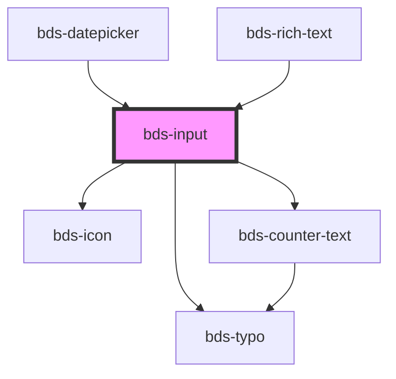

# bds-input

<!-- Auto Generated Below -->

## Properties

| Property                | Attribute                 | Description                                                                               | Type                                                                     | Default     |
| ----------------------- | ------------------------- | ----------------------------------------------------------------------------------------- | ------------------------------------------------------------------------ | ----------- |
| `autoCapitalize`        | `auto-capitalize`         | Defines automatic text capitalization (possible values: `on`, `off`).                     | `"characters" \| "none" \| "off" \| "on" \| "sentences" \| "words"`      | `'off'`     |
| `autoComplete`          | `auto-complete`           | Defines browser autocomplete behavior (possible values: `on`, `off`).                     | `"current-password" \| "new-password" \| "off" \| "on" \| "username"`    | `'off'`     |
| `autoResize`            | `auto-resize`             | Defines whether the textarea should automatically resize based on content.                | `boolean`                                                                | `true`      |
| `chips`                 | `chips`                   | Defines if the input will be displayed as chips (a type of input with multiple values).   | `boolean`                                                                | `undefined` |
| `cols`                  | `cols`                    | Defines the number of columns for the textarea (if `textarea`).                           | `number`                                                                 | `0`         |
| `counterLength`         | `counter-length`          | Defines whether a character length counter will be displayed.                             | `boolean`                                                                | `false`     |
| `counterLengthRule`     | --                        | Defines the character length counter rule (min, max, etc).                                | `{ warning: CounterTextRule; delete: CounterTextRule; }`                 | `null`      |
| `danger`                | `danger`                  | Defines if the input is in error state.                                                   | `boolean`                                                                | `false`     |
| `dataTest`              | `data-test`               | Data test is the prop to specifically test the component action.                          | `string`                                                                 | `null`      |
| `debounceDelay`         | `debounce-delay`          | Defines the debounce delay in milliseconds for textarea auto-resize.                      | `number`                                                                 | `100`       |
| `disabled`              | `disabled`                | Defines if the input is disabled.                                                         | `boolean`                                                                | `false`     |
| `emailErrorMessage`     | `email-error-message`     | Error message displayed when the input value is not a valid email.                        | `string`                                                                 | `undefined` |
| `encode`                | `encode`                  |                                                                                           | `boolean`                                                                | `false`     |
| `errorMessage`          | `error-message`           | Error message displayed when the input value is invalid.                                  | `string`                                                                 | `''`        |
| `helperMessage`         | `helper-message`          | Help message displayed below the input.                                                   | `string`                                                                 | `''`        |
| `icon`                  | `icon`                    | Name of the icon to be displayed inside the input.                                        | `string`                                                                 | `''`        |
| `iconSize`              | `icon-size`               | Defines the icon size (small or medium).                                                  | `"medium" \| "small"`                                                    | `'small'`   |
| `inputName`             | `input-name`              | Input name, used for form identification.                                                 | `string`                                                                 | `''`        |
| `isSubmit`              | `is-submit`               | Defines whether the input will be submitted when pressing Enter.                          | `boolean`                                                                | `false`     |
| `isTextarea`            | `is-textarea`             | Defines whether the input is a textarea.                                                  | `boolean`                                                                | `false`     |
| `label`                 | `label`                   | Label to be displayed above the input.                                                    | `string`                                                                 | `''`        |
| `max`                   | `max`                     | Defines the maximum allowed value for the input.                                          | `string`                                                                 | `undefined` |
| `maxErrorMessage`       | `max-error-message`       | Error message displayed when the input value doesn't meet the maximum allowed value.      | `string`                                                                 | `undefined` |
| `maxHeight`             | `max-height`              | Defines the maximum height of the textarea in pixels.                                     | `number`                                                                 | `200`       |
| `maxlength`             | `maxlength`               | Defines the maximum number of characters allowed in the input.                            | `number`                                                                 | `undefined` |
| `min`                   | `min`                     | Defines the minimum allowed value for the input.                                          | `string`                                                                 | `undefined` |
| `minErrorMessage`       | `min-error-message`       | Error message displayed when the input value doesn't meet the minimum allowed value.      | `string`                                                                 | `undefined` |
| `minHeight`             | `min-height`              | Defines the minimum height of the textarea in pixels.                                     | `number`                                                                 | `60`        |
| `minlength`             | `minlength`               | Defines the minimum number of characters allowed in the input.                            | `number`                                                                 | `undefined` |
| `minlengthErrorMessage` | `minlength-error-message` | Error message displayed when the input value doesn't meet the minimum length requirement. | `string`                                                                 | `undefined` |
| `numberErrorMessage`    | `number-error-message`    | Error message displayed when the input value is not a valid number.                       | `string`                                                                 | `undefined` |
| `pattern`               | `pattern`                 | Defines a regex pattern that the input value must follow.                                 | `string`                                                                 | `undefined` |
| `placeholder`           | `placeholder`             | Text to be displayed as a hint or placeholder in the input.                               | `string`                                                                 | `''`        |
| `readonly`              | `readonly`                | Makes the input read-only.                                                                | `boolean`                                                                | `false`     |
| `required`              | `required`                | Defines if the input is required.                                                         | `boolean`                                                                | `undefined` |
| `requiredErrorMessage`  | `required-error-message`  | Error message displayed when the input is not filled and is required.                     | `string`                                                                 | `undefined` |
| `resizable`             | `resizable`               | Defines whether the textarea can be manually resized by the user.                         | `boolean`                                                                | `false`     |
| `rows`                  | `rows`                    | Defines the number of lines for the textarea (if `textarea`).                             | `number`                                                                 | `3`         |
| `success`               | `success`                 | Defines if the input is in success state.                                                 | `boolean`                                                                | `false`     |
| `successMessage`        | `success-message`         | Message displayed when the input value is valid.                                          | `string`                                                                 | `''`        |
| `type`                  | `type`                    | Defines the input type (e.g., `text`, `password`, etc).                                   | `"date" \| "email" \| "number" \| "password" \| "phonenumber" \| "text"` | `'text'`    |
| `value`                 | `value`                   | The current value of the input.                                                           | `string`                                                                 | `''`        |

## Events

| Event                  | Description                                           | Type                         |
| ---------------------- | ----------------------------------------------------- | ---------------------------- |
| `bdsChange`            | Event emitted when the input value changes.           | `CustomEvent<any>`           |
| `bdsFocus`             | Event emitted when the input gains focus.             | `CustomEvent<any>`           |
| `bdsInput`             | Event emitted when the input receives input (typing). | `CustomEvent<KeyboardEvent>` |
| `bdsKeyDownBackspace`  | Event emitted when the "Backspace" key is pressed.    | `CustomEvent<any>`           |
| `bdsOnBlur`            | Event emitted when the input loses focus.             | `CustomEvent<any>`           |
| `bdsPatternValidation` | Event emitted for regex pattern validation.           | `CustomEvent<any>`           |
| `bdsSubmit`            | Event emitted when the form is submitted.             | `CustomEvent<any>`           |

## Methods

### `clear() => Promise<void>`

Clears the input field value.

#### Returns

Type: `Promise<void>`

### `getInputElement() => Promise<HTMLInputElement | HTMLTextAreaElement>`

Returns the input element of the component.

#### Returns

Type: `Promise<HTMLInputElement | HTMLTextAreaElement>`

### `isValid() => Promise<boolean>`

Checks if the input field is valid.

#### Returns

Type: `Promise<boolean>`

### `removeFocus() => Promise<void>`

Removes focus from the input field.

#### Returns

Type: `Promise<void>`

### `setFocus() => Promise<void>`

Sets focus to the input field.

#### Returns

Type: `Promise<void>`

## Shadow Parts

| Part                | Description |
| ------------------- | ----------- |
| `"input"`           |             |
| `"input-container"` |             |
| `"input__message"`  |             |

## Dependencies

### Used by

 - [bds-datepicker](../datepicker)
 - [bds-rich-text](../rict-text)

### Depends on

- [bds-icon](../icon)
- [bds-typo](../typo)
- [bds-counter-text](../counter-text)

### Graph

----------------------------------------------

*Built with [StencilJS](https://stenciljs.com/)*
