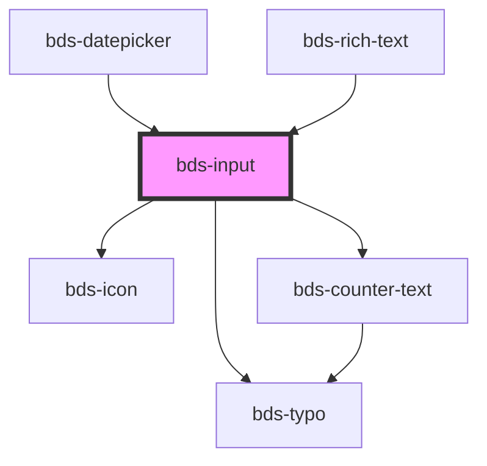

# bds-input

<!-- Auto Generated Below -->

## Properties

| Property                | Attribute                 | Description                                                                            | Type                                                                     | Default     |
| ----------------------- | ------------------------- | -------------------------------------------------------------------------------------- | ------------------------------------------------------------------------ | ----------- |
| `autoCapitalize`        | `auto-capitalize`         | Define a capitalização automática do texto (valores possíveis: `on`, `off`).           | `"characters" \| "none" \| "off" \| "on" \| "sentences" \| "words"`      | `'off'`     |
| `autoComplete`          | `auto-complete`           | Define o comportamento de autocompletar do navegador (valores possíveis: `on`, `off`). | `"current-password" \| "new-password" \| "off" \| "on" \| "username"`    | `'off'`     |
| `chips`                 | `chips`                   | Define se o input será exibido como chips (um tipo de entrada com múltiplos valores).  | `boolean`                                                                | `undefined` |
| `cols`                  | `cols`                    | Define a quantidade de colunas da área de texto (se for `textarea`).                   | `number`                                                                 | `0`         |
| `counterLength`         | `counter-length`          | Define se será exibido um contador de comprimento de caracteres.                       | `boolean`                                                                | `false`     |
| `counterLengthRule`     | --                        | Define a regra do contador de comprimento de caracteres (min, max, etc).               | `{ warning: CounterTextRule; delete: CounterTextRule; }`                 | `null`      |
| `danger`                | `danger`                  | Define se o input está em estado de erro.                                              | `boolean`                                                                | `false`     |
| `dataTest`              | `data-test`               | Data test é a prop para testar especificamente a ação do componente.                   | `string`                                                                 | `null`      |
| `disabled`              | `disabled`                | Define se o input está desabilitado.                                                   | `boolean`                                                                | `false`     |
| `emailErrorMessage`     | `email-error-message`     | Mensagem de erro exibida quando o valor do input não é um email válido.                | `string`                                                                 | `undefined` |
| `encode`                | `encode`                  |                                                                                        | `boolean`                                                                | `false`     |
| `errorMessage`          | `error-message`           | Mensagem de erro exibida quando o valor do input é inválido.                           | `string`                                                                 | `''`        |
| `helperMessage`         | `helper-message`          | Mensagem de ajuda exibida abaixo do input.                                             | `string`                                                                 | `''`        |
| `icon`                  | `icon`                    | Nome do ícone a ser exibido dentro do input.                                           | `string`                                                                 | `''`        |
| `inputName`             | `input-name`              | Nome do input, usado para identificação no formulário.                                 | `string`                                                                 | `''`        |
| `isSubmit`              | `is-submit`               | Define se o input será submetido ao pressionar Enter.                                  | `boolean`                                                                | `false`     |
| `isTextarea`            | `is-textarea`             | Define se o input é uma área de texto (textarea).                                      | `boolean`                                                                | `false`     |
| `label`                 | `label`                   | Rótulo que será exibido acima do input.                                                | `string`                                                                 | `''`        |
| `max`                   | `max`                     | Define o valor máximo permitido para o input.                                          | `string`                                                                 | `undefined` |
| `maxErrorMessage`       | `max-error-message`       | Mensagem de erro exibida quando o valor do input não atende ao valor máximo permitido. | `string`                                                                 | `undefined` |
| `maxlength`             | `maxlength`               | Define o número máximo de caracteres permitidos no input.                              | `number`                                                                 | `undefined` |
| `min`                   | `min`                     | Define o valor mínimo permitido para o input.                                          | `string`                                                                 | `undefined` |
| `minErrorMessage`       | `min-error-message`       | Mensagem de erro exibida quando o valor do input não atende ao valor mínimo permitido. | `string`                                                                 | `undefined` |
| `minlength`             | `minlength`               | Define o número mínimo de caracteres permitidos no input.                              | `number`                                                                 | `undefined` |
| `minlengthErrorMessage` | `minlength-error-message` | Mensagem de erro exibida quando o valor do input não atende ao comprimento mínimo.     | `string`                                                                 | `undefined` |
| `numberErrorMessage`    | `number-error-message`    | Mensagem de erro exibida quando o valor do input não é um número válido.               | `string`                                                                 | `undefined` |
| `pattern`               | `pattern`                 | Define um padrão regex que o valor do input deve seguir.                               | `string`                                                                 | `undefined` |
| `placeholder`           | `placeholder`             | Texto que será exibido como sugestão ou dica no input.                                 | `string`                                                                 | `''`        |
| `readonly`              | `readonly`                | Torna o input somente leitura.                                                         | `boolean`                                                                | `false`     |
| `required`              | `required`                | Define se o input é obrigatório.                                                       | `boolean`                                                                | `undefined` |
| `requiredErrorMessage`  | `required-error-message`  | Mensagem de erro exibida quando o input não é preenchido e é obrigatório.              | `string`                                                                 | `undefined` |
| `rows`                  | `rows`                    | Define a quantidade de linhas da área de texto (se for `textarea`).                    | `number`                                                                 | `1`         |
| `success`               | `success`                 | Define se o input está em estado de sucesso.                                           | `boolean`                                                                | `false`     |
| `successMessage`        | `success-message`         | Mensagem exibida quando o valor do input é válido.                                     | `string`                                                                 | `''`        |
| `type`                  | `type`                    | Define o tipo do input (por exemplo, `text`, `password`, etc).                         | `"date" \| "email" \| "number" \| "password" \| "phonenumber" \| "text"` | `'text'`    |
| `value`                 | `value`                   | O valor atual do input.                                                                | `string`                                                                 | `''`        |

## Events

| Event                  | Description                                                  | Type                         |
| ---------------------- | ------------------------------------------------------------ | ---------------------------- |
| `bdsChange`            | Evento disparado quando o valor do input muda.               | `CustomEvent<any>`           |
| `bdsFocus`             | Evento disparado quando o input ganha o foco.                | `CustomEvent<any>`           |
| `bdsInput`             | Evento disparado quando o input recebe um input (digitação). | `CustomEvent<KeyboardEvent>` |
| `bdsKeyDownBackspace`  | Evento disparado quando a tecla "Backspace" é pressionada.   | `CustomEvent<any>`           |
| `bdsOnBlur`            | Evento disparado quando o input perde o foco.                | `CustomEvent<any>`           |
| `bdsPatternValidation` | Evento disparado para validação de padrão regex.             | `CustomEvent<any>`           |
| `bdsSubmit`            | Evento disparado quando o formulário é submetido.            | `CustomEvent<any>`           |

## Methods

### `clear() => Promise<void>`

Limpa o valor do campo de entrada.

#### Returns

Type: `Promise<void>`

### `getInputElement() => Promise<HTMLInputElement>`

Retorna o elemento de input do componente.

#### Returns

Type: `Promise<HTMLInputElement>`

### `isValid() => Promise<boolean>`

Verifica se o campo de entrada é válido.

#### Returns

Type: `Promise<boolean>`

### `removeFocus() => Promise<void>`

Remove o foco do campo de entrada.

#### Returns

Type: `Promise<void>`

### `setFocus() => Promise<void>`

Define o foco no campo de entrada.

#### Returns

Type: `Promise<void>`

## Shadow Parts

| Part                | Description |
| ------------------- | ----------- |
| `"input"`           |             |
| `"input-container"` |             |
| `"input__message"`  |             |

## Dependencies

### Used by

 - [bds-datepicker](../datepicker)
 - [bds-rich-text](../rict-text)

### Depends on

- [bds-icon](../icon)
- [bds-typo](../typo)
- [bds-counter-text](../counter-text)

### Graph

----------------------------------------------

*Built with [StencilJS](https://stenciljs.com/)*
