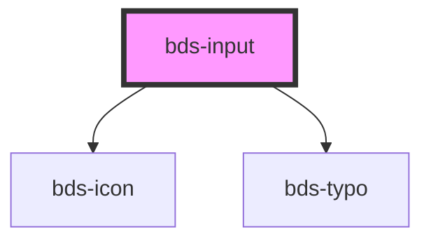

# bds-input

<!-- Auto Generated Below -->

## Properties

| Property               | Attribute     | Description | Type                   | Default     |
| ---------------------- | ------------- | ----------- | ---------------------- | ----------- |
| `danger`               | `danger`      |             | `boolean`              | `false`     |
| `iconLeft`             | `icon-left`   |             | `string`               | `''`        |
| `iconRight`            | `icon-right`  |             | `string`               | `''`        |
| `inputId` _(required)_ | `input-id`    |             | `string`               | `undefined` |
| `inputName`            | `input-name`  |             | `string`               | `''`        |
| `label`                | `label`       |             | `string`               | `''`        |
| `placeholder`          | `placeholder` |             | `string`               | `''`        |
| `type`                 | `type`        |             | `"text" \| "textarea"` | `'text'`    |
| `value`                | `value`       |             | `string`               | `''`        |

## Dependencies

### Depends on

- [bds-icon](../icon)
- [bds-typo](../typo)

### Graph

----------------------------------------------

*Built with [StencilJS](https://stenciljs.com/)*
