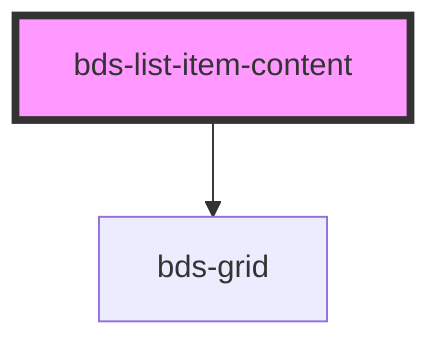

# bds-list-item

<!-- Auto Generated Below -->

## Properties

| Property         | Attribute         | Description | Type                                                                                                         | Default        |
| ---------------- | ----------------- | ----------- | ------------------------------------------------------------------------------------------------------------ | -------------- |
| `alignItems`     | `align-items`     |             | `"baseline" \| "center" \| "flex-end" \| "flex-start" \| "stretch"`                                          | `'flex-start'` |
| `direction`      | `direction`       |             | `"column" \| "column-reverse" \| "row" \| "row-reverse"`                                                     | `'column'`     |
| `flexWrap`       | `flex-wrap`       |             | `"wrap" \| "wrap-reverse"`                                                                                   | `'wrap'`       |
| `gap`            | `gap`             |             | `"1" \| "12" \| "2" \| "3" \| "4" \| "8" \| "half" \| "none"`                                                | `undefined`    |
| `justifyContent` | `justify-content` |             | `"center" \| "flex-end" \| "flex-start" \| "space-around" \| "space-between" \| "space-evenly" \| "stretch"` | `'flex-start'` |

## Dependencies

### Depends on

- [bds-grid](../grid)

### Graph

----------------------------------------------

*Built with [StencilJS](https://stenciljs.com/)*
