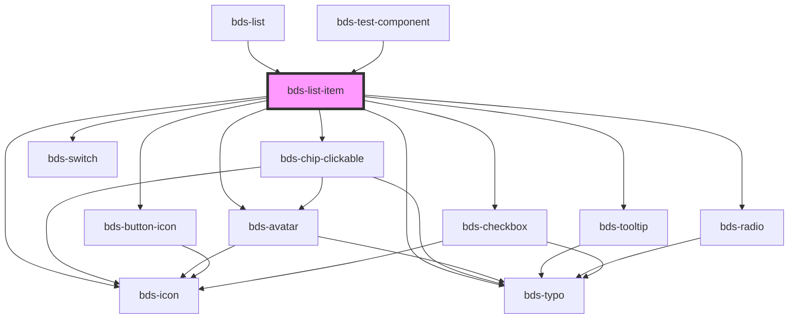

# bds-list-item

<!-- Auto Generated Below -->

## Properties

| Property          | Attribute          | Description                                                                                                                               | Type                                             | Default |
| ----------------- | ------------------ | ----------------------------------------------------------------------------------------------------------------------------------------- | ------------------------------------------------ | ------- |
| `actionsButtons`  | `actions-buttons`  | The actions buttons on the component Should be passed this way: actions-buttons='["copy", "settings-general", "more-options-horizontal"]' | `string \| string[]`                             | `[]`    |
| `active`          | `active`           | Active. Used to define when the item is highlighted.                                                                                      | `boolean`                                        | `false` |
| `avatarName`      | `avatar-name`      | AvatarName. Used to enter the avatar name.                                                                                                | `string`                                         | `null`  |
| `avatarThumbnail` | `avatar-thumbnail` | AvatarThumbnail. Used to insert the avatar photo.                                                                                         | `string`                                         | `null`  |
| `borderRadius`    | `border-radius`    | Enable rounded border on item                                                                                                             | `boolean`                                        | `false` |
| `checked`         | `checked`          |                                                                                                                                           | `boolean`                                        | `false` |
| `chips`           | `chips`            | The chips on the component Should be passed this way: chips='["chip1", "chip2"]'                                                          | `string \| string[]`                             | `[]`    |
| `clickable`       | `clickable`        | Clickable. Used to define if the item is clickable or not.                                                                                | `boolean`                                        | `false` |
| `icon`            | `icon`             | Icon. Used to add icon in list item.                                                                                                      | `string`                                         | `null`  |
| `secondaryText`   | `secondary-text`   | SecondaryText. Used to insert a secondaryText in the display item.                                                                        | `string`                                         | `null`  |
| `text`            | `text`             | Text. Used to insert a text in the display item.                                                                                          | `string`                                         | `null`  |
| `typeList`        | `type-list`        | Typelis. Used toselect type of item list.                                                                                                 | `"checkbox" \| "default" \| "radio" \| "switch"` | `null`  |
| `value`           | `value`            | Value. Used to insert a value in list item.                                                                                               | `string`                                         | `null`  |

## Events

| Event                  | Description                                                  | Type               |
| ---------------------- | ------------------------------------------------------------ | ------------------ |
| `bdsChecked`           | Emitted when the value has changed because of a click event. | `CustomEvent<any>` |
| `bdsClickActionButtom` | Emitted when click in someone actions buttom insert in data. | `CustomEvent<any>` |

## Dependencies

### Used by

 - [bds-list](.)
 - [bds-test-component](../test-component)

### Depends on

- [bds-chip-clickable](../chip-clickable)
- [bds-tooltip](../tooltip)
- [bds-button-icon](../icon-button)
- [bds-radio](../radio)
- [bds-checkbox](../checkbox)
- [bds-avatar](../avatar)
- [bds-icon](../icon)
- [bds-typo](../typo)
- [bds-switch](../bds-switch)

### Graph

----------------------------------------------

*Built with [StencilJS](https://stenciljs.com/)*
