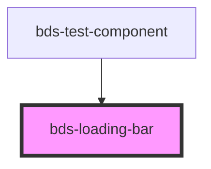

# bds-progress-bar

<!-- Auto Generated Below -->

## Properties

| Property   | Attribute   | Description                                                             | Type                   | Default     |
| ---------- | ----------- | ----------------------------------------------------------------------- | ---------------------- | ----------- |
| `dataTest` | `data-test` | Data test is the prop to specifically test the component action object. | `string`               | `null`      |
| `percent`  | `percent`   | Percent, property to enter the loading bar status percentage value.     | `number`               | `0`         |
| `size`     | `size`      | Size, property to define size of component.                             | `"default" \| "small"` | `'default'` |
| `text`     | `text`      | Text, property to enable the bar info text.                             | `string`               | `''`        |

## Dependencies

### Used by

 - [bds-test-component](../test-component)

### Graph

----------------------------------------------

*Built with [StencilJS](https://stenciljs.com/)*
