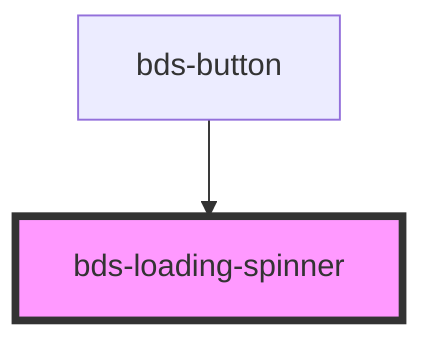

# bds-loading-spinner

<!-- Auto Generated Below -->

## Properties

| Property | Attribute | Description                                             | Type                | Default   |
| -------- | --------- | ------------------------------------------------------- | ------------------- | --------- |
| `color`  | `color`   | Sets the color of the spinner, can be 'light' or 'dark' | `"dark" \| "light"` | `'light'` |

## Dependencies

### Used by

 - [bds-button](../button)

### Graph

----------------------------------------------

*Built with [StencilJS](https://stenciljs.com/)*
