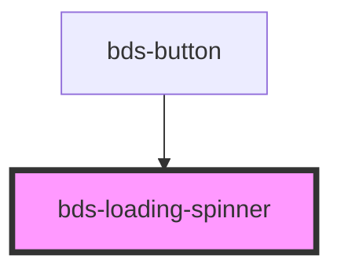

# bds-loading-spinner

<!-- Auto Generated Below -->

## Properties

| Property  | Attribute | Description                                                             | Type                                  | Default     |
| --------- | --------- | ----------------------------------------------------------------------- | ------------------------------------- | ----------- |
| `variant` | `variant` | Sets the color of the spinner, can be 'primary', 'secondary' or 'ghost' | `"ghost" \| "primary" \| "secondary"` | `'primary'` |

## Dependencies

### Used by

 - [bds-button](../button)

### Graph

----------------------------------------------

*Built with [StencilJS](https://stenciljs.com/)*
