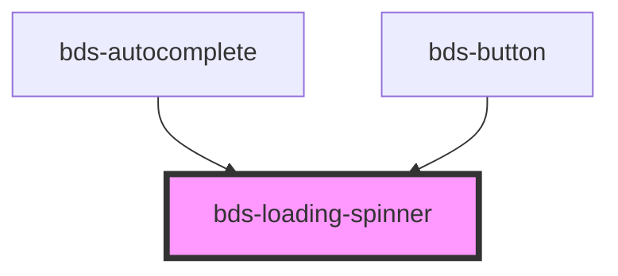

# bds-loading-spinner

<!-- Auto Generated Below -->

## Properties

| Property   | Attribute   | Description                                                                    | Type                                                            | Default      |
| ---------- | ----------- | ------------------------------------------------------------------------------ | --------------------------------------------------------------- | ------------ |
| `color`    | `color`     | Color, Entered as one of the color. Can be one of: 'default', 'white'.         | `"content" \| "light" \| "main" \| "negative" \| "positive"`    | `'main'`     |
| `dataTest` | `data-test` | Data test is the prop to specifically test the component action object.        | `string`                                                        | `null`       |
| `size`     | `size`      | Size, Entered as one of the size. Can be one of: 'small', 'standard', 'large'. | `"extra-small" \| "small" \| "standard"`                        | `'standard'` |
| `variant`  | `variant`   | Sets the color of the spinner, can be 'primary', 'secondary' or 'ghost'        | `"delete" \| "ghost" \| "primary" \| "secondary" \| "tertiary"` | `'primary'`  |

## Dependencies

### Used by

 - [bds-autocomplete](../autocomplete)
 - [bds-button](../button)

### Graph

----------------------------------------------

*Built with [StencilJS](https://stenciljs.com/)*
