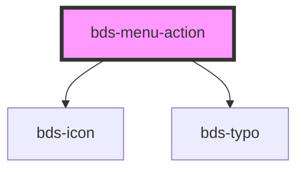

# bds-menu-item

<!-- Auto Generated Below -->

## Properties

| Property     | Attribute     | Description  | Type      | Default |
| ------------ | ------------- | ------------ | --------- | ------- |
| `buttonText` | `button-text` | description. | `string`  | `''`    |
| `iconleft`   | `iconleft`    | description. | `string`  | `null`  |
| `lipstick`   | `lipstick`    | description. | `boolean` | `false` |
| `subMenu`    | `sub-menu`    | description. | `boolean` | `false` |

## Dependencies

### Depends on

- [bds-icon](../../icon)
- [bds-typo](../../typo)

### Graph

----------------------------------------------

*Built with [StencilJS](https://stenciljs.com/)*
