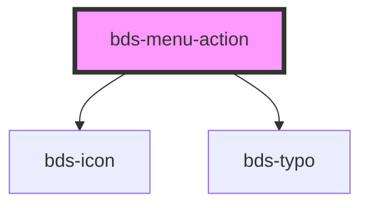

# bds-menu-item

<!-- Auto Generated Below -->

## Properties

| Property      | Attribute     | Description                                                                                   | Type      | Default |
| ------------- | ------------- | --------------------------------------------------------------------------------------------- | --------- | ------- |
| `buttonText`  | `button-text` | ButtonText. Used to enter the display text for the item.                                      | `string`  | `''`    |
| `description` | `description` | Description. Used to insert a subtitle in the display item.                                   | `string`  | `null`  |
| `iconLeft`    | `icon-left`   | Iconleft. Used to insert the string icon and make the icon available to the left of the item. | `string`  | `null`  |
| `lipstick`    | `lipstick`    | Lipstick. Used to declare that the item will be a negative/error action.                      | `boolean` | `false` |
| `subMenu`     | `sub-menu`    | SubMenu. Used to declare that the button will have a submenu.                                 | `boolean` | `false` |
| `subtitle`    | `subtitle`    | Subtitle. Used to insert a subtitle in the display item.                                      | `string`  | `null`  |

## Dependencies

### Depends on

- [bds-icon](../../icon)
- [bds-typo](../../typo)

### Graph

----------------------------------------------

*Built with [StencilJS](https://stenciljs.com/)*
