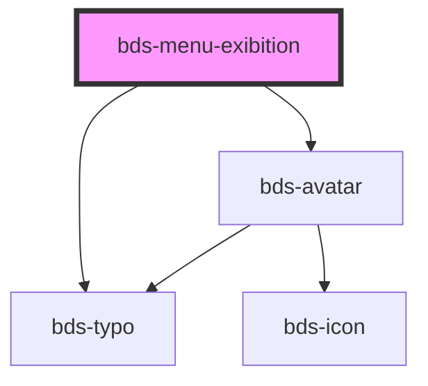

# bds-menu-avatar

<!-- Auto Generated Below -->

## Properties

| Property          | Attribute          | Description                                                 | Type                                     | Default      |
| ----------------- | ------------------ | ----------------------------------------------------------- | ---------------------------------------- | ------------ |
| `avatarName`      | `avatar-name`      | AvatarName. Used to enter the avatar name.                  | `string`                                 | `null`       |
| `avatarSize`      | `avatar-size`      | AvatarSize. Used to set avatar size.                        | `"extra-small" \| "small" \| "standard"` | `'standard'` |
| `avatarThumbnail` | `avatar-thumbnail` | AvatarThumbnail. Used to insert the avatar photo.           | `string`                                 | `null`       |
| `description`     | `description`      | Description. Used to insert a subtitle in the display item. | `string`                                 | `null`       |
| `disabled`        | `disabled`         | Disabled. Used to declare that the item will be disabled.   | `boolean`                                | `false`      |
| `subtitle`        | `subtitle`         | Subtitle. Used to insert a subtitle in the display item.    | `string`                                 | `null`       |
| `value`           | `value`            | Value. Used to insert a title in the display item.          | `string`                                 | `null`       |

## Dependencies

### Depends on

- [bds-avatar](../../avatar)
- [bds-typo](../../typo)

### Graph

----------------------------------------------

*Built with [StencilJS](https://stenciljs.com/)*
