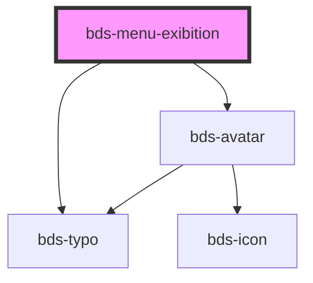

# bds-menu-avatar

<!-- Auto Generated Below -->

## Properties

| Property          | Attribute          | Description | Type                                     | Default      |
| ----------------- | ------------------ | ----------- | ---------------------------------------- | ------------ |
| `avatarName`      | `avatar-name`      | description | `string`                                 | `null`       |
| `avatarSize`      | `avatar-size`      | description | `"extra-small" \| "small" \| "standard"` | `'standard'` |
| `avatarThumbnail` | `avatar-thumbnail` | description | `string`                                 | `null`       |
| `subtitle`        | `subtitle`         | description | `string`                                 | `null`       |
| `value`           | `value`            | description | `string`                                 | `null`       |

## Dependencies

### Depends on

- [bds-avatar](../../avatar)
- [bds-typo](../../typo)

### Graph

----------------------------------------------

*Built with [StencilJS](https://stenciljs.com/)*
